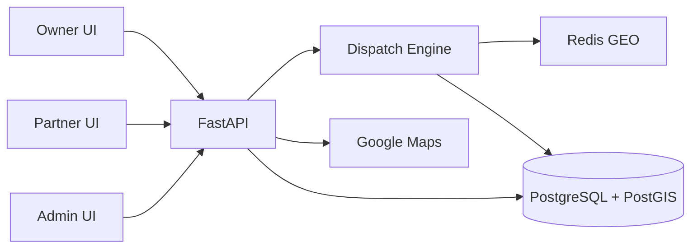
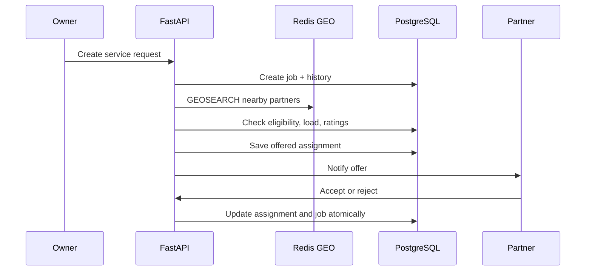
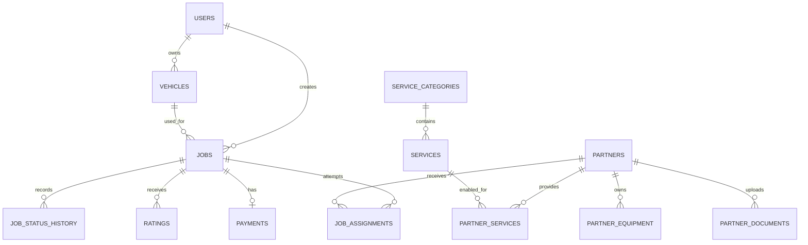
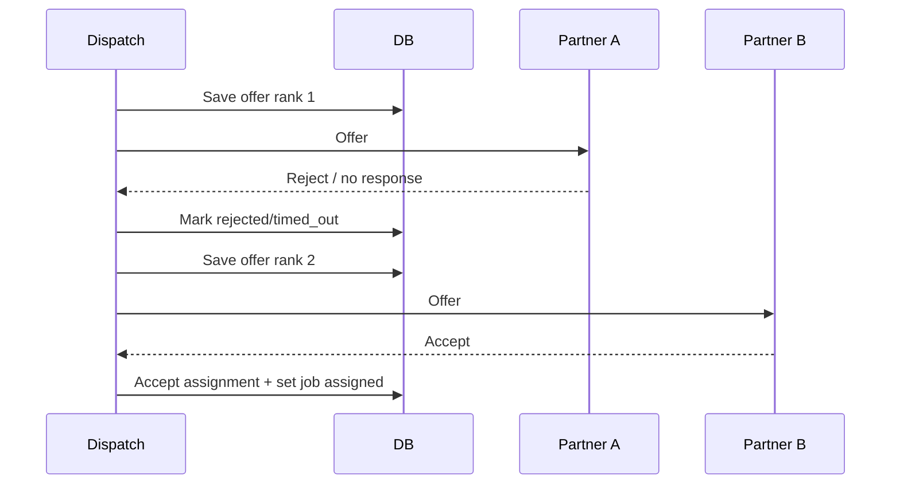

# Sahayak — Complete Project Documentation
## Product Development Track

**Formal OJT title:** Real-Time Emergency Vehicle Assistance and Service Dispatch Platform  
**Project Code:** PD-01  
**Track:** Product Development  
**Group:** G273  
**Version:** 1.0  
**Status:** Draft — implementation plan and submission baseline  
**Date:** 2026-09-06  
**Duration:** 20 weeks (5 months)  
**Team:** Vinit Jangir (backend, data, dispatch) and Adarsh Pratap Singh (frontend, admin UI)  
**Mentor:** Subham Das  
**Institution:** Polaris School of Technology, Bengaluru  

---

## Table of Contents

1. Project Overview
2. Business Requirements Document (BRD)
3. Product Requirements Document (PRD)
4. UX Requirements
5. Technical Requirements Document (TRD)
6. High-Level Design (HLD)
7. Database / Data Design
8. API Specification
9. Low-Level Design (LLD)
10. Full Stack Architecture
11. Security Design
12. Testing Strategy
13. CI/CD Pipeline
14. Observability Design
15. Deployment Architecture
16. Cost Analysis
17. Project Roadmap
18. Team Responsibilities
19. GitHub Repository Structure
20. README
21. Architecture Decision Records (ADRs)
22. Traceability Matrix
23. Interview Preparation Questions
24. Viva / Project Defense Questions
25. Quality Score

---

# Project Overview — Sahayak

## Project Identity

| Field | Value |
|---|---|
| Product name | Sahayak |
| Formal title | Real-Time Emergency Vehicle Assistance and Service Dispatch Platform |
| Geography | Bengaluru, India (MVP) |
| Users | Vehicle owners, verified service partners, operations admins |
| Vehicle types | Two-wheelers and four-wheelers |
| Stack | React, FastAPI, PostgreSQL/PostGIS, Redis GEO, Docker, Google Maps API |
| Delivery window | 20 weeks |

## Problem Summary

When a vehicle breaks down, owners usually search Google Maps or call personal contacts. Static shop pins do not show whether a mechanic is available, capable of the requested service, willing to travel, or likely to arrive on time. The result is long downtime, price uncertainty, and no accountability for no-shows.

## Proposed Solution

Sahayak lets an owner submit a roadside-help request with a live pickup location, vehicle and issue details. The dispatch engine finds nearby verified partners in Redis, validates their exact service and equipment eligibility in PostgreSQL, scores candidates by distance, workload, skill match, and rating, then makes sequential offers. The owner can track job status; partners accept or reject work in one unified app; operations staff can intervene when automation cannot find a confident match.

## Core Capabilities

1. User, partner, and admin roles.
2. Vehicle registration and roadside service requests.
3. Live partner location updates and nearby-partner search.
4. Unified partner capability, equipment, and document verification.
5. Explainable weighted dispatch with assignment-attempt history.
6. Job lifecycle tracking, notifications, ratings, and test-mode payment records.
7. Operations dashboard with a manual dispatch override.
8. Benchmarking against a nearest-partner baseline.

## Business Value

| Stakeholder | Value |
|---|---|
| Vehicle owner | Faster, clearer access to a verified local helper during a stressful incident |
| Service partner | Relevant jobs without maintaining separate apps for mechanic, tow, and fuel work |
| Operations team | Live visibility and a human fallback for failed matching |
| Academic evaluator | A measurable dispatch system, not only CRUD screens |

## Distinguishing Product Principle

The product is not a map directory. Its differentiator is a dispatch process that records each offer and compares a quality-aware match with a naïve nearest-partner approach.

---

# Business Requirements Document (BRD)
## Sahayak

**Document ID:** BRD-PD-01  
**Version:** 1.0  
**Status:** Draft  
**Date:** 2026-09-06  
**Track:** Product Development  

---

## 1. Executive Summary

Sahayak is a Bengaluru-first roadside-assistance marketplace and dispatch platform for flat tyres, jump-starts, minor repair, emergency fuel delivery, and towing. It solves the gap between discovering a shop and receiving a reliable, accountable service dispatch.

## 2. Problem Statement

Vehicle owners lack a reliable on-demand mechanism to obtain assistance from an available and suitable nearby partner. Existing discovery channels do not offer live availability, guaranteed response windows, dispatch accountability, or transparent ETAs.

### Market evidence

Competitor research (ReadyAssist, DriveFixit, RoadServe, GoMechanic TopAssist) shows the problem is real but poorly solved, not unsolved. ReadyAssist — Bengaluru-HQ'd, founded 2016, ~$6-7M raised across multiple rounds, an active insurance partnership with Navi (May 2026) — carries a **1.9-star / 99-review** consumer app rating despite that scale. This indicates the category's incumbents succeed on B2B/insurance contracts, not on consumer-facing dispatch quality, which is precisely the gap Sahayak's assignment-log and quality-aware matching approach targets. Tracxn tracks roughly 40 active competitors nationally with no dominant winner, confirming an open, unresolved execution problem rather than a saturated, settled one.

## 3. Vision

> Make emergency roadside help as trackable and accountable as a modern delivery experience, while giving local service partners relevant, fairly assigned work.

## 4. Objectives

| ID | Objective | Target evidence | Target date |
|---|---|---|---|
| OBJ-01 | Validate problem and supply assumptions | 20–25 owner and 20–25 mechanic interviews; manual pilot | Month 2 |
| OBJ-02 | Deliver request-to-assignment flow | Functional end-to-end demo | Month 3 |
| OBJ-03 | Implement quality-aware dispatch | Comparison with nearest-partner baseline | Month 3 |
| OBJ-04 | Support operator recovery | Admin manual assignment and status view | Month 4 |
| OBJ-05 | Verify system behavior under load | Documented Locust or k6 results | Month 4 |
| OBJ-06 | Produce demo-ready deployment and documentation | Staging demo and final report | Month 5 |

## 5. Target Users / Personas

### Persona 1 — Asha, stranded vehicle owner

| Attribute | Detail |
|---|---|
| Goal | Get trustworthy help quickly without calling many shops |
| Pain points | Unsure who is available, how long help will take, and what it will cost |
| Needs | Clear service selection, location sharing, ETA/status, verified partner, rating |

### Persona 2 — Ramesh, independent mechanic / tow operator

| Attribute | Detail |
|---|---|
| Goal | Receive nearby jobs matching his skills and equipment |
| Pain points | Wasted travel, incomplete issue information, uncertain payout |
| Needs | Service-specific offers, accept/reject time window, job details, fair allocation |

### Persona 3 — Operations administrator

| Attribute | Detail |
|---|---|
| Goal | Keep requests from failing and maintain supply quality |
| Needs | Live requests, assignment history, document verification, manual override |

## 6. User Journey

```text
Breakdown → select vehicle/service → share pickup point and details
→ dispatch engine ranks eligible partners → offer accepted or retries next partner
→ owner sees status/ETA → partner arrives and completes work → rating and payment record
```

## 7. Business Use Cases

| ID | Use case | Primary actor | Outcome |
|---|---|---|---|
| UC-01 | Request roadside help | Owner | A job enters matching |
| UC-02 | Update availability and location | Partner | Partner becomes discoverable for eligible jobs |
| UC-03 | Accept/reject an offered job | Partner | Assignment is accepted or next candidate is tried |
| UC-04 | Manual dispatch | Admin | An operator recovers a failing request |
| UC-05 | Verify partner documents/equipment | Admin | Only trusted capability enters matching |
| UC-06 | Rate completed assistance | Owner/partner | Trust signal is retained |

## 8. Functional Business Requirements

| ID | Requirement | Priority | Acceptance criterion |
|---|---|---|---|
| BR-01 | Create a job with service, vehicle and location | Must | Valid request becomes `requested` with immutable pickup snapshot |
| BR-02 | Match only verified, available, capable partners | Must | Ineligible partner never receives an offer |
| BR-03 | Record every offer attempt | Must | Rejection/timeout history remains available per job |
| BR-04 | Rank candidates beyond distance | Must | Score includes distance, active load, skill and rating |
| BR-05 | Unified partner experience | Must | One partner can provide multiple services/categories |
| BR-06 | Live job status | Must | Owner and partner see current status and key updates |
| BR-07 | Admin verification and override | Must | Admin can approve documents and manually assign |
| BR-08 | Rating | Should | One user and one partner rating per completed job |
| BR-09 | Test-mode payment record | Should | Payment state is stored without real money movement |

## 9. Non-Functional Business Requirements

| Category | Requirement |
|---|---|
| Performance | Dispatch must return a candidate set fast enough for an emergency interaction; final benchmark target documented after baseline test |
| Reliability | Failed or timed-out offer must advance safely without losing history |
| Privacy | Exact location and contact data visible only to authorized participants |
| Scalability | Location writes use Redis; historical data remains in PostgreSQL |
| Usability | Core request flow usable on a mobile-sized screen |
| Auditability | Status and assignment history reconstruct the fulfillment path |

## 10. Success Metrics

| Metric | Measurement |
|---|---|
| Dispatch latency | `first_offered_at - requested_at` |
| Partner acceptance rate | accepted offers / total offers |
| Offers before acceptance | average assignment rank of accepted offers |
| No-match rate | no-match jobs / requested jobs |
| ETA accuracy | actual arrival compared with estimate where arrival is captured |
| Matching comparison | weighted score outcome versus nearest eligible partner baseline |
| Pilot conversion | completed pilot requests / incoming pilot requests |

## 11. Assumptions

- Partners consent to share location while available.
- Google Maps billing and API keys are configured with budget alerts.
- The initial supply network is limited to Bengaluru.
- Real-money payment processing is not required for MVP.

## 12. Constraints

| Constraint | Decision |
|---|---|
| Team and time | Two students, five-month OJT |
| Geography | Bengaluru only |
| Payments | Test/stub mode only; no regulated payment handling |
| Supply quality | Depends on local partner onboarding and verification |
| Maps cost | Must remain within configured Google Cloud budget |

## 13. Risks

| Risk | Impact | Mitigation |
|---|---|---|
| Insufficient available partners | High | Interview supply early; manual WhatsApp pilot; admin fallback |
| Partner no-shows or slow responses | High | Offer timeout, assignment history, ratings, suspension process |
| Scope creep | High | Lock MVP services and Bengaluru geography |
| Location inaccuracies | Medium | Display last-update time; require periodic location refresh |
| Map API spend | Medium | Restrict keys, quotas, billing alerts |

## 14. MVP Scope

**In scope:** authentication, vehicles, core seeded services, partner onboarding/verification, live availability/location, dispatch, job lifecycle, admin dashboard, ratings, test payment status, Docker deployment, load-test plan.

**Out of scope:** real payment collection, insurance integrations, nationwide service, a separate app per service type, EV-specific flow, SOS escalation, guaranteed commercial SLA.

## 15. Future Scope

Membership plans, insurance/B2B integrations, EV support, SOS escalation, multilingual UX, dynamic pricing, fraud detection, smarter ETA models, and regional expansion.

---

# Product Requirements Document (PRD)
## Sahayak

**Document ID:** PRD-PD-01  
**Version:** 1.0  
**Status:** Draft  
**Date:** 2026-09-06  
**Track:** Product Development  

---

## 1. Product Vision

Build a trustworthy emergency-assistance experience where the best available local partner—not just the closest pin—is dispatched with visible progress and an operations fallback.

## 2. Product Goals

| Goal | Product interpretation |
|---|---|
| Speed | Reduce time from request to a meaningful partner offer |
| Fit | Assign exact-service/equipment-capable partners |
| Trust | Show verification, job history, status and ratings |
| Resilience | Retry offers and permit manual operations intervention |
| Evidence | Measure engine outcomes against a nearest-only baseline |

## 3. Features

### Must Have

| ID | Feature | Description |
|---|---|---|
| F-01 | Account and role access | Owner, partner, admin authentication and authorization |
| F-02 | Vehicle profile | Store owner vehicles and snapshot vehicle number on each job |
| F-03 | Service request | Service, pickup, optional drop point, description and photos |
| F-04 | Partner availability | Toggle availability and publish current location |
| F-05 | Capability registry | Partner-services and partner-equipment verification |
| F-06 | Dispatch engine | Nearby search, eligibility filter, scoring, sequential offers |
| F-07 | Job tracking | Status updates from requested through completed/cancelled |
| F-08 | Operations dashboard | Request monitoring, document review, manual override |

### Should Have

Ratings, push/SMS abstraction, ETA display, image uploads, basic analytics, test-mode payment state.

### Could Have

Membership, EV assistance, chat/calling masking, surge pricing, insurance claim flow.

## 4. User Stories

| ID | Story | Acceptance criterion |
|---|---|---|
| US-01 | As an owner, I can save a vehicle so a request contains accurate vehicle information. | Vehicle is selectable and its registration is copied to the job. |
| US-02 | As an owner, I can request flat-tyre support at my live location. | Valid request creates a job and begins matching. |
| US-03 | As a partner, I can turn availability on and share my location. | Redis location exists only while the partner is available. |
| US-04 | As a partner, I can accept or reject an offer. | Response is recorded once; accepted job cannot be accepted by another partner. |
| US-05 | As an admin, I can verify a tow truck and documents. | Equipment-required jobs exclude unverified equipment owners. |
| US-06 | As an owner, I can see status after a partner accepts. | Job reflects assigned/en-route/in-progress/completed transitions. |
| US-07 | As an admin, I can review failed offers and assign manually. | Assignment rank/history remains intact after override. |
| US-08 | As an owner, I can rate completed help. | A single owner rating updates partner aggregate safely. |

## 5. User Flows

### Request and dispatch

```text
Owner: select vehicle → select service → confirm map location → submit
System: validate → create job → set matching → search Redis → filter PostgreSQL
→ score candidates → create offered assignment → notify top candidate
Partner: accept → atomically set assignment accepted and job assigned
or reject/timeout → mark attempt → offer next candidate → no candidates: no_match_found + admin queue
```

### Completion

```text
Partner en route → partner starts work → completes work → owner rates → payment record settled in test mode
```

## 6. Acceptance Criteria Summary

The MVP is acceptable when a seeded owner can create each core service request, only eligible partners are selected, an offer rejection advances to the next ranked partner, a successful assignment changes the job state, admin override works, and the full flow is covered by integration tests and demo data.

---

# UX Requirements
## Sahayak

**Document ID:** UX-PD-01  
**Version:** 1.0  
**Status:** Draft  
**Date:** 2026-09-06  
**Track:** Product Development  

---

## 1. Information Architecture

```text
Owner: Home → My Vehicles → Request Help → Matching/Tracking → Job Detail → Rating
Partner: Availability → Offers → Active Job → Job History → Services/Equipment → Profile
Admin: Dashboard → Live Jobs → Job Detail → Partners → Documents → Equipment → Analytics
```

## 2. UX Flows

- **Owner emergency flow:** provide location first, keep service choices short, then show matching progress instead of a blank wait state.
- **Partner offer flow:** surface service, pickup distance, vehicle, issue, payout estimate (if configured), and time remaining before accept/reject.
- **Admin recovery flow:** show job status, candidate/offer log and action to assign an eligible partner manually.

## 3. Screen Requirements

| Screen | Required content/actions |
|---|---|
| Owner home | Help CTA, saved vehicles, recent jobs |
| Request help | Service cards, vehicle, map pickup, issue notes/photos, submit |
| Matching/tracking | Status, partner details after assignment, ETA, support/cancel action |
| Partner home | availability toggle, location freshness, pending offers, active job |
| Offer detail | job context, route distance, accept/reject, response timer |
| Admin live jobs | filters, state, offered/accepted partner, manual assignment |
| Partner verification | documents, capabilities, equipment status, approve/reject reason |

## 4. Accessibility

- Meet WCAG 2.1 AA color contrast where practical.
- Never identify status only by color; pair with text/icon.
- Provide focus states, keyboard-operable admin controls, form labels and error text.
- Use plain language during emergency flows; do not rely on map gestures alone.

## 5. UX Principles

1. Emergency-first: location and request submission take priority.
2. Trust is visible: show verification and clear job progression.
3. No false promises: label ETAs as estimates and show last location update.
4. Minimize cognitive load: one decision per step.
5. Recover gracefully: tell the user when matching is continuing or an operator is assisting.

## 6. Design System Tokens

| Token | Suggested value/use |
|---|---|
| Primary | `#0F766E` — trustworthy teal action color |
| Danger | `#B91C1C` — emergency/cancel alerts |
| Success | `#15803D` — completed/verified state |
| Warning | `#B45309` — pending/matching state |
| Surface | `#FFFFFF`; background `#F8FAFC` |
| Typography | Inter or system sans-serif; minimum 16px body on mobile |
| Spacing | 4px base scale: 4, 8, 12, 16, 24, 32 |

## 7. Component Library (React)

`Button`, `StatusBadge`, `ServiceCard`, `VehicleSelector`, `LocationPicker`, `OfferTimer`, `JobTimeline`, `PartnerCard`, `RatingInput`, `DataTable`, `VerificationReview`, `ConfirmDialog`, `Toast`, and reusable protected-route layouts.

---

# Technical Requirements Document (TRD)
## Sahayak

**Document ID:** TRD-PD-01  
**Version:** 1.0  
**Status:** Draft  
**Date:** 2026-09-06  
**Track:** Product Development  

---

## 1. Technical Goals

- Implement a dependable assignment state machine with auditable offer attempts.
- Separate volatile partner location from durable transactional data.
- Make dispatch rules configurable and testable in Python.
- Support a responsive React interface for all three roles.

## 2. Technical Constraints

Python/FastAPI and React are the chosen team stack. PostgreSQL must have PostGIS enabled. Redis is required for geospatial presence. Kubernetes is optional after Docker Compose works. Google Maps needs secured billing-backed keys. Payment integration remains mocked.

## 3. Technology Selection

| Layer | Choice | Reason |
|---|---|---|
| API | FastAPI / Python | Async support, validation, OpenAPI generation |
| Web UI | React + TypeScript | Reuse across owner/partner views; typed UI |
| Durable DB | PostgreSQL + PostGIS | Relational integrity and geographic job records |
| Live geo | Redis GEO | Frequent location writes and proximity search |
| Maps | Google Maps API | Geocoding, routes, directions, ETA input |
| Auth/storage | Supabase or self-hosted equivalent | Rapid student-project setup; auth/storage option |
| Containers | Docker Compose | Repeatable local and staging environments |
| Testing | pytest, Playwright, Locust or k6 | Unit, browser and load-test coverage |

## 4. System Requirements

| Area | Requirement |
|---|---|
| Backend runtime | Python 3.11+ recommended |
| Database | PostgreSQL 15+ with PostGIS and pgcrypto |
| Cache | Redis 7+ with GEO commands |
| Browser | Modern Chromium/Firefox/Safari; mobile-responsive layout |
| Container runtime | Docker Engine and Docker Compose v2 |

## 5. Functional Technical Requirements

| ID | Requirement |
|---|---|
| TR-01 | APIs validate role, ownership, payload shape and legal state transition. |
| TR-02 | Partner location is written to Redis only after availability validation. |
| TR-03 | Dispatch filters Redis candidates using verified service/equipment and current availability. |
| TR-04 | A transaction/lock prevents two partners accepting the same job. |
| TR-05 | Every state transition adds `job_status_history`; every offer adds `job_assignments`. |
| TR-06 | API publishes OpenAPI documentation and health endpoints. |

## 6. Non-Functional Requirements

| Area | Target / policy |
|---|---|
| Availability | Graceful failure messaging and manual ops fallback for matching failures |
| Performance | Measure dispatch latency under seeded and concurrent load; avoid premature fixed claims |
| Data integrity | Foreign keys, checks, unique constraints, transaction boundaries |
| Maintainability | API/service/repository separation, linting, type validation, migrations |
| Security | Role-based authorization, TLS in deployment, no secrets in repository |

## 7. API Requirements

REST JSON under `/api/v1`; bearer authentication for protected routes; consistent error envelope; pagination for admin listings; UTC ISO-8601 timestamps; OpenAPI at `/docs` in non-production/staging as appropriate.

## 8. Integration Requirements

| Integration | Use | Boundary |
|---|---|---|
| Google Maps | address search, directions, route/ETA estimate | Keep key server-restricted where possible; quota monitor |
| Redis | live geo and optional short-lived offer timers | Not source of truth for completed jobs |
| Supabase/storage | optional auth and issue-photo storage | Use signed URLs; never expose storage credentials |
| SMS/push provider | future notification adapter | Implement interface; use development stub initially |

## 9. Security Requirements

JWT/session validation, RBAC for roles, password hashing if passwords are managed locally, rate limiting for auth endpoints, signed upload URLs, strict CORS allow-list, audit metadata for admin decisions, and secrets through environment variables.

## 10. Observability Requirements

Structured logs with correlation/job IDs; counters for requests, offers, accepts, rejects, timeouts, no-match outcomes and errors; dispatch duration histogram; `/health` and `/ready` endpoints.

## 11. Deployment Requirements

Docker images for frontend and API, Compose services for API/Postgres/Redis, migrations before release, environment-specific secrets, non-root containers where feasible, health checks, backups for PostgreSQL, and a documented rollback image tag.

---

# High-Level Design (HLD)
## Sahayak

**Document ID:** HLD-PD-01  
**Version:** 1.0  
**Status:** Draft  
**Date:** 2026-09-06  
**Track:** Product Development  

---

## 1. System Architecture

```text
Owner React app ─┐                         ┌─ Partner React app
                 ├── HTTPS ── FastAPI ─────┤
Admin React app ─┘             │            └─ Google Maps APIs
                               ├── Dispatch service ── Redis GEO (live locations)
                               ├── Auth / jobs / partner services
                               └── PostgreSQL + PostGIS (durable data)
```

## 2. Architecture Diagram



## 3. Component Responsibilities

| Component | Responsibility |
|---|---|
| Owner UI | Request creation, tracking, cancellation, rating |
| Partner UI | Availability/location, offers, job execution, profile |
| Admin UI | Verification, live operations, manual dispatch, analytics |
| API | Auth, validation, authorization, orchestration |
| Dispatch engine | Candidate search/filter/score/offer/retry |
| Redis GEO | Current available partner positions |
| PostgreSQL/PostGIS | Users, jobs, history, capabilities, ratings, payments |

## 4. Data Flow

1. Partner turns available and periodically posts latitude/longitude.
2. API validates partner state and updates Redis GEO membership.
3. Owner submits a job; API writes the job and `requested` history in PostgreSQL.
4. Dispatch uses GEOSEARCH, then checks candidates against durable capability and active-load data.
5. API persists a scored offer and sends a notification through an adapter.
6. Accept/reject/timeout updates assignment and job state transactionally.

## 5. Request Flow (Sequence)



## 6. Scalability

API instances remain stateless and can scale horizontally. Redis absorbs frequent location updates. PostgreSQL stores only durable records and uses PostGIS indexes for historical geographic queries. Dispatch work should be queueable later if traffic exceeds synchronous API capacity.

## 7. Reliability

Offer retries prevent a single rejection from failing the job. Assignment history enables recovery and diagnostics. Admin override is the first-stage operational safety net. Database backups, migrations, health probes and idempotency keys for request submission reduce failure impact.

## 8. Security Architecture

All clients use HTTPS. API authorization separates owners, partners and admins. Ownership checks constrain jobs and vehicles; partners see only their offers/assigned jobs. Partner documents and issue images use private storage/signed access.

## 9. Observability

The application emits structured lifecycle events keyed by request/job/assignment IDs. Dashboard metrics focus on matching latency, offer outcomes, active partners, location freshness, no-match rate and API errors.

## 10. Deployment Architecture

Development uses Docker Compose. Staging can use Supabase plus managed Redis or a small DigitalOcean environment using student credit. Kubernetes is deliberately deferred until core behavior and tests exist.

---

# Database / Data Design
## Sahayak

**Document ID:** DB-PD-01  
**Version:** 1.0  
**Status:** Draft  
**Date:** 2026-09-06  
**Track:** Product Development  

---

## 1. Data Requirements

The model must preserve user/vehicle relationships; service capabilities; equipment/document verification; job snapshots; every assignment attempt; status history; two-way ratings; and test-mode payments. Live partner coordinates are intentionally excluded from PostgreSQL.

## 2. Entities

`users`, `vehicles`, `service_categories`, `services`, `admins`, `partners`, `partner_services`, `partner_equipment`, `partner_documents`, `jobs`, `job_assignments`, `job_status_history`, `ratings`, `payments`, `notifications`.

## 3. Entity Relationships

- A user owns many vehicles and jobs.
- A service category has many services.
- A partner has many services, documents, equipment and assignment attempts.
- A job has many assignments and status-history records, but only one ultimately accepted assignment.
- A completed job may have one rating from each side and one payment record.

## 4. ER Diagram



## 5. Schema

The authoritative DDL is maintained as versioned SQL/Alembic migrations. Required design rules:

| Table | Essential fields / constraints |
|---|---|
| `users` | UUID, name, unique phone/email, verification state |
| `vehicles` | user FK, two/four-wheeler check, registration number |
| `services` | category FK, unique code, `requires_vehicle_equipment` |
| `partners` | verification and availability state, rating aggregate; no live coordinate |
| `partner_services` | composite PK `(partner_id, service_id)` |
| `partner_equipment` | equipment type, verification status |
| `jobs` | user/vehicle/service FKs, lifecycle state, PostGIS pickup/drop points, price snapshots |
| `job_assignments` | job/partner FKs, offer/response timestamps, score, rank, outcome |
| `ratings` | unique `(job_id, rated_by)`, 1–5 check |

Job states: `requested`, `matching`, `assigned`, `partner_en_route`, `in_progress`, `completed`, `cancelled`, `no_match_found`. Assignment states: `offered`, `accepted`, `rejected`, `timed_out`, `completed`.

### Core SQL DDL Reference

The following reference schema is the initial migration design; the implemented migration files remain authoritative.

```sql
CREATE EXTENSION IF NOT EXISTS postgis;
CREATE EXTENSION IF NOT EXISTS "pgcrypto";

CREATE TABLE users (
  id UUID PRIMARY KEY DEFAULT gen_random_uuid(), name VARCHAR(100) NOT NULL,
  phone VARCHAR(15) UNIQUE NOT NULL, email VARCHAR(150) UNIQUE,
  phone_verified BOOLEAN DEFAULT FALSE, created_at TIMESTAMPTZ DEFAULT now()
);
CREATE TABLE vehicles (
  id UUID PRIMARY KEY DEFAULT gen_random_uuid(), user_id UUID REFERENCES users(id) ON DELETE CASCADE,
  vehicle_type VARCHAR(20) CHECK (vehicle_type IN ('two_wheeler','four_wheeler')),
  make VARCHAR(50), model VARCHAR(50), vehicle_number VARCHAR(20) NOT NULL,
  created_at TIMESTAMPTZ DEFAULT now()
);
CREATE TABLE service_categories (
  id SERIAL PRIMARY KEY, code VARCHAR(30) UNIQUE NOT NULL, name VARCHAR(60) NOT NULL
);
CREATE TABLE services (
  id SERIAL PRIMARY KEY, category_id INTEGER REFERENCES service_categories(id),
  code VARCHAR(40) UNIQUE NOT NULL, name VARCHAR(60) NOT NULL,
  requires_vehicle_equipment BOOLEAN DEFAULT FALSE
);
CREATE TABLE admins (
  id UUID PRIMARY KEY DEFAULT gen_random_uuid(), name VARCHAR(100), email VARCHAR(150) UNIQUE,
  role VARCHAR(20) DEFAULT 'ops' CHECK (role IN ('ops','super_admin')),
  created_at TIMESTAMPTZ DEFAULT now()
);
CREATE TABLE partners (
  id UUID PRIMARY KEY DEFAULT gen_random_uuid(), name VARCHAR(100) NOT NULL,
  phone VARCHAR(15) UNIQUE NOT NULL, primary_category_id INTEGER REFERENCES service_categories(id),
  verification_status VARCHAR(20) DEFAULT 'pending'
    CHECK (verification_status IN ('pending','verified','rejected','suspended')),
  is_independent_contractor BOOLEAN DEFAULT TRUE, is_available BOOLEAN DEFAULT FALSE,
  rating_avg NUMERIC(2,1) DEFAULT 0.0, rating_count INTEGER DEFAULT 0,
  created_at TIMESTAMPTZ DEFAULT now(), updated_at TIMESTAMPTZ DEFAULT now()
);
CREATE INDEX idx_partners_availability ON partners (is_available) WHERE is_available = TRUE;
CREATE TABLE partner_services (
  partner_id UUID REFERENCES partners(id) ON DELETE CASCADE,
  service_id INTEGER REFERENCES services(id), PRIMARY KEY (partner_id, service_id)
);
CREATE TABLE partner_equipment (
  id UUID PRIMARY KEY DEFAULT gen_random_uuid(), partner_id UUID REFERENCES partners(id) ON DELETE CASCADE,
  equipment_type VARCHAR(40), registration_number VARCHAR(30),
  verification_status VARCHAR(20) DEFAULT 'pending' CHECK (verification_status IN ('pending','verified','rejected')),
  verified_at TIMESTAMPTZ, created_at TIMESTAMPTZ DEFAULT now()
);
CREATE TABLE partner_documents (
  id UUID PRIMARY KEY DEFAULT gen_random_uuid(), partner_id UUID REFERENCES partners(id) ON DELETE CASCADE,
  doc_type VARCHAR(30), file_url TEXT,
  status VARCHAR(20) DEFAULT 'pending' CHECK (status IN ('pending','approved','rejected','expired')),
  verified_by UUID REFERENCES admins(id), verified_at TIMESTAMPTZ, rejection_reason TEXT,
  expiry_date DATE, uploaded_at TIMESTAMPTZ DEFAULT now()
);
CREATE TABLE jobs (
  id UUID PRIMARY KEY DEFAULT gen_random_uuid(), user_id UUID REFERENCES users(id),
  vehicle_id UUID REFERENCES vehicles(id), vehicle_number VARCHAR(20),
  service_id INTEGER REFERENCES services(id) NOT NULL,
  status VARCHAR(20) DEFAULT 'requested' CHECK (status IN
    ('requested','matching','assigned','partner_en_route','in_progress','completed','cancelled','no_match_found')),
  pickup_location GEOGRAPHY(POINT,4326) NOT NULL, pickup_address_text TEXT,
  drop_location GEOGRAPHY(POINT,4326), issue_description TEXT, issue_photo_urls TEXT[],
  price_estimate NUMERIC(8,2), price_final NUMERIC(8,2), requested_at TIMESTAMPTZ DEFAULT now(),
  completed_at TIMESTAMPTZ, cancelled_at TIMESTAMPTZ, cancellation_reason TEXT
);
CREATE INDEX idx_jobs_status ON jobs(status);
CREATE INDEX idx_jobs_pickup_location ON jobs USING GIST(pickup_location);
CREATE TABLE job_assignments (
  id UUID PRIMARY KEY DEFAULT gen_random_uuid(), job_id UUID REFERENCES jobs(id) ON DELETE CASCADE,
  partner_id UUID REFERENCES partners(id),
  status VARCHAR(20) DEFAULT 'offered' CHECK (status IN ('offered','accepted','rejected','timed_out','completed')),
  offered_at TIMESTAMPTZ DEFAULT now(), responded_at TIMESTAMPTZ, accepted_at TIMESTAMPTZ,
  distance_at_offer_m NUMERIC(10,2), estimated_arrival_min INTEGER,
  matching_score NUMERIC(8,4), assignment_rank SMALLINT, rejection_reason TEXT
);
CREATE INDEX idx_assignments_job ON job_assignments(job_id);
CREATE INDEX idx_assignments_partner ON job_assignments(partner_id);
CREATE TABLE job_status_history (
  id UUID PRIMARY KEY DEFAULT gen_random_uuid(), job_id UUID REFERENCES jobs(id) ON DELETE CASCADE,
  status VARCHAR(20), changed_at TIMESTAMPTZ DEFAULT now(), note TEXT
);
CREATE TABLE ratings (
  id UUID PRIMARY KEY DEFAULT gen_random_uuid(), job_id UUID REFERENCES jobs(id),
  rated_by VARCHAR(10) CHECK (rated_by IN ('user','partner')),
  rating SMALLINT CHECK (rating BETWEEN 1 AND 5), comment TEXT,
  created_at TIMESTAMPTZ DEFAULT now(), UNIQUE(job_id,rated_by)
);
CREATE TABLE payments (
  id UUID PRIMARY KEY DEFAULT gen_random_uuid(), job_id UUID REFERENCES jobs(id), amount NUMERIC(8,2),
  status VARCHAR(20) DEFAULT 'pending' CHECK (status IN ('pending','paid','failed','refunded')),
  payment_method VARCHAR(20), gateway_ref_id VARCHAR(100), created_at TIMESTAMPTZ DEFAULT now()
);
CREATE TABLE notifications (
  id UUID PRIMARY KEY DEFAULT gen_random_uuid(),
  recipient_type VARCHAR(10) CHECK (recipient_type IN ('user','partner')), recipient_id UUID,
  channel VARCHAR(10) CHECK (channel IN ('push','sms')), message TEXT, is_read BOOLEAN DEFAULT FALSE,
  sent_at TIMESTAMPTZ DEFAULT now(), job_id UUID REFERENCES jobs(id)
);
```

## 6. Redis Key Structures

| Key | Type | Purpose / TTL |
|---|---|---|
| `geo:available_partners` | GEO sorted set | partner id → current point; remove when unavailable |
| `partner:{id}:location_meta` | hash/string | last update timestamp and optional accuracy; short TTL |
| `offer:{assignment_id}:timeout` | string | idempotent timeout marker; TTL equals response window |
| `idempotency:job:{key}` | string | protects duplicate job submit; bounded TTL |

## 7. Indexing Strategy

`jobs(status)`, `jobs USING GIST(pickup_location)`, `job_assignments(job_id)`, `job_assignments(partner_id)`, partial `partners(is_available) WHERE is_available = true`, unique phones/emails/codes, and joins on partner-service keys. Query plans are verified with realistic seed data.

## 8. Query Patterns

1. Find open jobs for admin by status/time.
2. Find a partner’s active assignments to derive active load.
3. Fetch candidate capability and verified equipment for a requested service.
4. Fetch ordered job assignment log for operations/audit.
5. Aggregate partner ratings after a valid user rating.

## 9. Data Integrity

Use foreign keys, check constraints, unique ratings, immutable snapshot fields, migrations, database transactions, and service-layer state-transition guards. `active_job_count` is derived rather than cached. Partner ratings may be denormalized but update only through a controlled transaction/trigger.

## 10. Data Lifecycle

Live locations expire from Redis when stale or unavailable. Completed/cancelled jobs remain durable for reporting. Photo/document retention periods and deletion requests must be defined before public launch; academic demo data must be synthetic or consented.

## 11. Backup and Recovery

Enable managed PostgreSQL backups or scheduled `pg_dump` backups, test a restore before final demonstration, and document migration rollback/forward plans. Redis geo state is rebuildable from active partners reconnecting and is not the recovery source of truth.

---

# API Specification
## Sahayak

**Document ID:** API-PD-01  
**Version:** 1.0  
**Status:** Draft  
**Date:** 2026-09-06  
**Track:** Product Development  

---

**Base URL:** `/api/v1`  
**Format:** JSON over HTTPS  
**Authentication:** `Authorization: Bearer <access-token>` for protected endpoints.

## Common Response and Error Format

```json
{"data": {}, "meta": {"request_id": "uuid"}}
```

```json
{"error": {"code": "INVALID_STATE", "message": "Job cannot be completed before it is in progress."}, "request_id": "uuid"}
```

## 1. Authentication Endpoints

| Method | Path | Purpose |
|--------------|----------------------------------------|----------------------------------------------|
| POST | `/auth/register` | Register owner or initiate partner registration |
| POST | `/auth/login` | Authenticate and issue session/token |
| POST | `/auth/verify-phone` | Confirm OTP/phone in configured auth provider |
| POST | `/auth/refresh` | Refresh valid session where supported |
| POST | `/auth/logout` | Invalidate local/managed session |

## 2. Owner, Vehicle and Job Endpoints

| Method | Path | Purpose |
|--------------|----------------------------------------|----------------------------------------------|
| GET/POST | `/vehicles` | List/create caller’s vehicles |
| PATCH/DELETE | `/vehicles/{vehicle_id}` | Update/delete owner vehicle |
| GET | `/services` | List categories and bookable services |
| POST | `/jobs` | Create a service request; accepts `Idempotency-Key` |
| GET | `/jobs` | List caller’s jobs; admin may filter |
| GET | `/jobs/{job_id}` | Get job, timeline and authorized assignment detail |
| POST | `/jobs/{job_id}/cancel` | Cancel when transition is legal |
| POST | `/jobs/{job_id}/rating` | Submit caller rating after completion |

Example create request:

```json
{"vehicle_id":"uuid","service_id":4,"pickup":{"lat":12.9716,"lng":77.5946,"address":"Bengaluru"},"issue_description":"Rear tyre puncture"}
```

## 3. Partner Endpoints

| Method | Path | Purpose |
|--------------|----------------------------------------|----------------------------------------------|
| GET/PATCH | `/partner/profile` | Read/update profile within allowed fields |
| POST | `/partner/availability` | Turn availability on/off |
| POST | `/partner/location` | Publish current coordinate while available |
| GET | `/partner/offers` | List pending offers |
| POST | `/assignments/{assignment_id}/accept` | Accept exact open offer |
| POST | `/assignments/{assignment_id}/reject` | Reject offer with optional reason |
| POST | `/jobs/{job_id}/status` | Advance assigned job through allowed partner states |
| GET | `/partner/jobs` | Active/history job list |

## 4. Admin Endpoints

| Method | Path | Purpose |
|--------------|----------------------------------------|----------------------------------------------|
| GET | `/admin/jobs` | Filterable live and historical requests |
| POST | `/admin/jobs/{job_id}/assign` | Manual assignment to an eligible partner |
| GET/PATCH | `/admin/partners/{partner_id}` | Review partner state |
| POST | `/admin/documents/{document_id}/review` | Approve/reject document with reason |
| POST | `/admin/equipment/{equipment_id}/review` | Approve/reject equipment |
| GET | `/admin/metrics/dispatch` | Aggregated dispatch metrics |

## 5. Notification and Payment Endpoints

| Method | Path | Purpose |
|--------------|----------------------------------------|----------------------------------------------|
| GET | `/notifications` | Authorized recipient’s notifications |
| POST | `/payments/{job_id}/simulate` | Demo/test-mode payment transition only |

## 6. Health Check Endpoints

| Method | Path | Expected result |
|--------------|----------------------------------------|----------------------------------------------|
| GET | `/health` | process liveness |
| GET | `/ready` | dependencies required for serving are reachable |
| GET | `/metrics` | protected or internal Prometheus-style metrics endpoint |

## 7. Status and Error Rules

Use `400` validation error, `401` unauthenticated, `403` unauthorized, `404` missing resource, `409` duplicate/idempotency/state conflict, `422` schema validation, `429` auth endpoint throttling, and `500` unexpected server failure. Do not leak partner documents, secret values or unmasked personal contact details in errors.

---

# Low-Level Design (LLD)
## Sahayak

**Document ID:** LLD-PD-01  
**Version:** 1.0  
**Status:** Draft  
**Date:** 2026-09-06  
**Track:** Product Development  

---

## 1. Module Architecture

```text
app/
  api/          route handlers and dependencies
  models/       ORM tables
  schemas/      Pydantic request/response contracts
  services/     dispatch, jobs, partner, notification, map services
  repositories/ database access/query composition
  utils/        scoring, time, ids, error helpers
  middlewares/  correlation, auth, error handling
  config/       settings and dependency wiring
```

## 2. Classes / Interfaces

| Unit | Responsibility |
|---|---|
| `DispatchService` | coordinates candidate discovery, filtering, scoring and offer creation |
| `GeoRepository` | Redis GEO add/remove/search and location freshness checks |
| `PartnerRepository` | verified services/equipment, availability and active-load queries |
| `JobService` | validates owner action and legal job transitions |
| `AssignmentService` | creates/responds to offers atomically and schedules retry |
| `ScoringStrategy` | calculates a documented score from normalized candidate inputs |
| `NotificationService` | hides push/SMS/stub implementation behind one interface |
| `MapsService` | geocode/route/ETA adapter with quota-safe error handling |

`ScoringStrategy` is the only unit permitted to compute a ranking value, and it is
deliberately a pure function of a `Candidate` dataclass — no database session, no clock,
no network. That purity is what makes the scoring unit tests in the Testing Strategy
meaningful and the benchmark reproducible. Its complete specification, formulas, weights
and reference implementation are given in §3.

## 3. Dispatch Algorithm

The dispatch engine is the primary engineering contribution of this project. This
section specifies it completely: the hard eligibility gates, the scoring components
and their exact formulas, the weight set, the deterministic ranking rule, the
reference implementation, and the baseline experiment it is measured against.

### 3.1 Eligibility gates (hard filters, evaluated before scoring)

Scoring never rescues an ineligible partner. Every gate below is a boolean exclusion
applied to the Redis `GEOSEARCH` result set before any score is computed.

| Gate | Condition | Reason |
|---|---|---|
| Availability | `partners.is_available = TRUE` | Partner has opted in to receive work |
| Verification | `partners.verification_status = 'verified'` | Unverified supply never receives an offer |
| Service capability | row exists in `partner_services` for `jobs.service_id` | Exact bookable service, not category |
| Equipment | if `services.requires_vehicle_equipment` then a `partner_equipment` row of the required type with `verification_status = 'verified'` | A tow job needs a verified truck, not a claim of one |
| Concurrency cap | derived `active_jobs < MAX_CONCURRENT_JOBS` | Prevents queueing a request behind saturated supply |
| Location freshness | `location_age_seconds <= MAX_LOCATION_AGE_S` | A stale coordinate makes the distance input meaningless |
| Not already tried | no existing `job_assignments` row for this `(job_id, partner_id)` | A partner who rejected is not re-offered the same job |

The concurrency cap is deliberately a gate rather than a score input. A partner at
capacity should be excluded outright, not merely ranked lower, because a low score
would still allow selection when the candidate pool is thin.

### 3.2 Scoring components

All four components are normalized to `[0, 1]` where higher is better, so weights are
directly comparable and the final score is interpretable on a fixed scale.

| Component | Formula | Behaviour |
|---|---|---|
| `distance` | `1 − min(d / R, 1)` | `1.0` at the pickup point, decaying linearly to `0.0` at the search radius `R` |
| `load` | `1 / (1 + active_jobs)` | `1.0` idle, `0.5` at one active job, `0.333` at two |
| `skill` | `0.5 + 0.5 · min(completed_for_service / T, 1)` | Verified capability floors at `0.5`; service-specific experience lifts it to `1.0` at `T` completed jobs |
| `rating` | `((r_avg · n) + (m · w)) / (n + w) / 5` | Bayesian-smoothed rating with prior mean `m` and prior weight `w`, mapped to `[0,1]` |

**Two corrections against the earlier draft formula.** The original design expressed
distance as `w1 · (1 / distance_km)` and load as `w2 · (1 / active_job_count)`. Both
are unbounded and both fail at their most important input:

- `1 / distance` diverges toward infinity as a partner approaches the pickup point, so
  a single very close candidate can dominate the sum regardless of every other signal.
  It is also undefined at `distance = 0`, which is a reachable value.
- `1 / active_job_count` raises `ZeroDivisionError` for an idle partner — precisely the
  *most* desirable candidate in the pool.

The bounded forms above remove both failure modes and keep every component on the same
scale, which is what makes the weights meaningful rather than arbitrary.

**Why `skill` is not simply a boolean.** A candidate that reaches scoring has already
passed the service and equipment gates, so a binary "has this service" term would be
`1.0` for every candidate and carry no ranking information. The component therefore
measures *depth* of capability: a newly verified partner starts at `0.5` because they
are genuinely qualified, and accumulates the remaining `0.5` through completed jobs of
that specific service.

**Why `rating` is smoothed.** A partner with one 5-star rating should not outrank a
partner with a long 4.6-star record. Shrinking the observed mean toward a prior
(`m = 3.5`, `w = 5`) makes a single review worth roughly one sixth of the final value
and gives new partners a fair, non-zero starting position. This directly addresses the
cold-start problem created by launching with a small verified supply base.

### 3.3 Weights

| Weight | Initial value | Justification |
|---|---:|---|
| `w_distance` | 0.45 | Arrival time is the product's core promise during a breakdown |
| `w_load` | 0.20 | Spreads work across supply and avoids queueing behind a busy partner |
| `w_skill` | 0.20 | Service-specific experience reduces second-visit and on-site-failure risk |
| `w_rating` | 0.15 | Real quality signal, but the sparsest and most gameable input, so weighted lowest |

Weights sum to exactly `1.0`, which confines the total score to `[0, 1]`. This is
asserted at import time so a mis-edited configuration fails loudly rather than silently
skewing dispatch.

`w_distance` is deliberately held below `0.5`. If distance dominated the sum, the engine
would converge on the nearest-partner baseline it is supposed to be evaluated against,
and the central experiment of this project would measure nothing.

These are **initial values chosen by reasoning, not by measurement.** They are
configuration, not constants, and the roadmap allocates weight tuning to the evaluation
phase once seeded benchmarks and pilot data exist.

### 3.4 Deterministic ranking and tie-break

Reproducibility is a testing requirement: the same candidate set must always produce the
same ordering, or seeded scenarios and baseline comparisons cannot be trusted. Candidates
are sorted by a total ordering:

1. `score` descending
2. `distance_m` ascending
3. `rating_count` descending — prefer the better-evidenced partner
4. `partner_id` ascending — final deterministic tie-break

The `partner_id` term guarantees a total order even for candidates identical on every
other key, which removes dependence on database row order or Redis reply order.

### 3.5 Reference implementation

```python
# app/utils/scoring.py
from dataclasses import dataclass

R_SEARCH_M          = 7000.0   # dispatch search radius (m)
MAX_CONCURRENT_JOBS = 2        # hard eligibility gate, not a score input
MAX_LOCATION_AGE_S  = 120      # stale coordinates are untrustworthy for distance
EXPERIENCE_TARGET   = 10       # completed jobs of a service for full skill credit
PRIOR_MEAN          = 3.5      # Bayesian prior for an unrated partner
PRIOR_WEIGHT        = 5.0      # how many "virtual" ratings the prior is worth

WEIGHTS = {"distance": 0.45, "load": 0.20, "skill": 0.20, "rating": 0.15}
assert abs(sum(WEIGHTS.values()) - 1.0) < 1e-9, "weights must sum to 1.0"


@dataclass(frozen=True)
class Candidate:
    partner_id: str
    distance_m: float
    active_jobs: int
    completed_for_service: int
    rating_avg: float
    rating_count: int


def distance_component(distance_m: float, radius_m: float = R_SEARCH_M) -> float:
    """1.0 at the pickup point, decaying linearly to 0.0 at the search radius.
    Bounded — unlike 1/distance, which diverges as distance approaches zero."""
    if distance_m <= 0:
        return 1.0
    return 1.0 - min(distance_m / radius_m, 1.0)


def load_component(active_jobs: int) -> float:
    """1.0 when idle, 0.5 at one active job, 0.33 at two.
    Uses 1/(1+n) so an idle partner (n=0) does not divide by zero."""
    return 1.0 / (1.0 + max(active_jobs, 0))


def skill_component(completed_for_service: int, target: int = EXPERIENCE_TARGET) -> float:
    """Verified capability floors at 0.5; service-specific experience lifts it to 1.0.
    A candidate that failed the service filter never reaches scoring at all."""
    if target <= 0:
        return 1.0
    return 0.5 + 0.5 * min(completed_for_service / target, 1.0)


def rating_component(rating_avg: float, rating_count: int) -> float:
    """Bayesian-smoothed rating mapped to [0,1]. One lucky 5-star cannot outrank
    a long record, and a brand-new partner sits near the prior rather than at zero."""
    smoothed = ((rating_avg * rating_count) + (PRIOR_MEAN * PRIOR_WEIGHT)) / (
        rating_count + PRIOR_WEIGHT
    )
    return max(0.0, min(smoothed / 5.0, 1.0))


def score(c: Candidate):
    """Returns (total, components). Components are persisted for explainability."""
    parts = {
        "distance": distance_component(c.distance_m),
        "load":     load_component(c.active_jobs),
        "skill":    skill_component(c.completed_for_service),
        "rating":   rating_component(c.rating_avg, c.rating_count),
    }
    return sum(WEIGHTS[k] * v for k, v in parts.items()), parts


def rank(candidates):
    """Deterministic total ordering. partner_id breaks any residual tie so that
    seeded test scenarios and baseline comparisons are exactly reproducible."""
    scored = []
    for c in candidates:
        total, parts = score(c)
        scored.append((total, parts, c))
    scored.sort(key=lambda t: (-t[0], t[2].distance_m, -t[2].rating_count, t[2].partner_id))
    return scored


def baseline_pick(candidates):
    """Nearest-only control: what the naive strategy would have chosen."""
    if not candidates:
        return None
    return min(candidates, key=lambda c: (c.distance_m, c.partner_id)).partner_id
```

### 3.6 Worked example

A flatbed-towing request with five candidates that have already cleared every
eligibility gate. Component values are computed with the constants above.

| Rank | Partner | Distance | Active jobs | Tows done | Rating | `d_c` | `l_c` | `s_c` | `r_c` | **Score** |
|---:|---|---:|---:|---:|---|---:|---:|---:|---:|---:|
| 1 | P-B | 1800 m | 0 | 9 | 4.6 (22) | 0.743 | 1.000 | 0.950 | 0.879 | **0.8562** |
| 2 | P-C | 2600 m | 0 | 12 | 4.9 (31) | 0.629 | 1.000 | 1.000 | 0.941 | **0.8240** |
| 3 | P-A | 1200 m | 2 | 14 | 4.8 (40) | 0.829 | 0.333 | 1.000 | 0.931 | **0.7792** |
| 4 | P-D | 900 m | 1 | 1 | 5.0 (1) | 0.871 | 0.500 | 0.550 | 0.750 | **0.7146** |
| 5 | P-E | 4300 m | 0 | 20 | 4.4 (55) | 0.386 | 1.000 | 1.000 | 0.865 | **0.7033** |

Weighted selection is **P-B**. Nearest-only selection would have been **P-D** at 900 m.
The two strategies diverge, and the reason is legible: P-D is closest but already holds
an active job, has completed a single tow, and carries one 5-star review that smoothing
reduces to `0.750` rather than `1.000`. P-A is closer than P-B and highly experienced,
but sits at the concurrency limit, so its load component collapses to `0.333`.

This is precisely the case the project exists to test. If weighted and nearest selection
never diverged, the engine would add nothing over a proximity sort.

### 3.7 Full dispatch procedure

```text
dispatch(job_id):
  acquire advisory lock on job_id            # one dispatch loop per job
  job     = load job, service, requirements
  set job.status = 'matching', append job_status_history

  raw     = REDIS.GEOSEARCH(geo:available_partners, job.pickup, R_SEARCH_M, ASC)
  if raw is empty or Redis unreachable:
      set job.status = 'no_match_found'; alert ops queue; return

  eligible = apply §3.1 gates to raw (single batched PostgreSQL query)
  if eligible is empty:
      set job.status = 'no_match_found'; alert ops queue; return

  ranked   = rank(eligible)                  # §3.4 deterministic ordering
  baseline = baseline_pick(eligible)         # nearest-only control, recorded not offered

  for position, (total, parts, cand) in enumerate(ranked, start=1):
      if position > MAX_OFFER_ATTEMPTS: break
      INSERT job_assignments (
          job_id, partner_id      = cand.partner_id,
          status                  = 'offered',
          assignment_rank         = position,
          distance_at_offer_m     = cand.distance_m,
          estimated_arrival_min   = maps_eta_or_null(cand, job),
          matching_score          = total,
          score_components        = parts,      # JSONB, explainability
          was_baseline_choice     = (cand.partner_id == baseline)
      )
      notify(cand.partner_id, offer)
      outcome = await_response(OFFER_TIMEOUT_S)

      if outcome == 'accepted':
          # conditional update — the race guard, see §3.8
          rows = UPDATE job_assignments SET status='accepted', accepted_at=now()
                 WHERE id = :assignment_id AND status = 'offered'
          if rows == 1 and job still in 'matching':
              set job.status = 'assigned'; append history; return SUCCESS
      else:
          UPDATE job_assignments SET status = outcome,      # 'rejected' | 'timed_out'
                 responded_at = now() WHERE id = :assignment_id
          continue

  set job.status = 'no_match_found'; append history; alert ops queue for manual dispatch
```

The loop is bounded by `MAX_OFFER_ATTEMPTS` so a job with many marginal candidates fails
into human handling within a predictable time rather than cycling indefinitely while the
owner waits.

### 3.8 Concurrency guarantee

Two partners may tap Accept simultaneously. Correctness rests on a single conditional
update rather than on application-level checking:

```sql
UPDATE job_assignments
   SET status = 'accepted', accepted_at = now(), responded_at = now()
 WHERE id = :assignment_id
   AND status = 'offered';          -- fails if already resolved
```

The `AND status = 'offered'` predicate makes the transition atomic at the row level. The
loser observes `rowcount = 0` and receives `409 Conflict`. The job row is promoted to
`assigned` in the same transaction, guarded by `WHERE status = 'matching'`, so a job can
never hold two accepted assignments. No table lock and no application mutex is required.

### 3.9 Baseline comparison and evaluation design

For every dispatch the engine records both the weighted selection and the nearest-only
selection over the identical candidate set, in the same request. The baseline is computed
and logged but never offered — it is a shadow control, so no owner receives a worse
service in order to generate data.

Derived measures, all available from `job_assignments`:

| Measure | Definition |
|---|---|
| Divergence rate | jobs where weighted top-1 ≠ nearest top-1, over all matched jobs |
| Acceptance rate by strategy | accept rate of weighted picks vs. of picks that were also the baseline |
| Offers before acceptance | mean `assignment_rank` of accepted assignments |
| Dispatch latency | `first offered_at − requested_at` |
| No-match rate | `no_match_found` jobs over requested jobs |
| Component attribution | which component most often drives a divergent choice, from `score_components` |

**Honest limitation.** Shadow logging shows *that* the strategies disagree and how often,
but it cannot prove the weighted choice was better, because the counterfactual is
unobservable — we never learn what the nearest partner would have done had they been
offered the job. Establishing causality would require randomising strategy per request
(an A/B design) and a request volume a five-month student pilot will not reach. This
document therefore claims divergence and explainability as demonstrable results, and
treats outcome superiority as a hypothesis with a stated method, not a finding.

### 3.10 Configuration parameters

Every value below is environment configuration, tunable without code change, and each is
recorded alongside published benchmark results so any measurement can be reproduced.

| Parameter | Default | Effect |
|---|---:|---|
| `R_SEARCH_M` | 7000 | Search radius; also the distance normaliser |
| `MAX_CONCURRENT_JOBS` | 2 | Concurrency gate per partner |
| `MAX_LOCATION_AGE_S` | 120 | Staleness gate on Redis coordinates |
| `EXPERIENCE_TARGET` | 10 | Completed service jobs for full skill credit |
| `PRIOR_MEAN` / `PRIOR_WEIGHT` | 3.5 / 5.0 | Rating smoothing strength |
| `OFFER_TIMEOUT_S` | 45 | Partner response window before timeout |
| `MAX_OFFER_ATTEMPTS` | 5 | Offers before failing into manual dispatch |
| `WEIGHTS` | 0.45 / 0.20 / 0.20 / 0.15 | Distance / load / skill / rating |

### 3.11 Additive schema support

Two nullable columns support explainability and the baseline experiment. Both are
additive and safe to apply to a deployed v2.1 schema:

```sql
ALTER TABLE job_assignments ADD COLUMN score_components   JSONB;
ALTER TABLE job_assignments ADD COLUMN was_baseline_choice BOOLEAN;
```

`score_components` stores the four normalized values behind `matching_score`, which turns
"the algorithm chose this partner" into an auditable statement an operator can read.
`was_baseline_choice` records whether the nearest-only strategy would have made the same
pick, which is what makes divergence rate queryable with a single aggregate.

## 4. State Machines

| Entity | Allowed transitions |
|---|---|
| Job | `requested → matching → assigned → partner_en_route → in_progress → completed` |
| Job alternate | `requested/matching/assigned → cancelled`; `matching → no_match_found` |
| Assignment | `offered → accepted/rejected/timed_out`; accepted may later be marked completed |
| Partner | `pending → verified/rejected`; verified may become suspended |

All transitions verify actor role and source state. Completion and rating eligibility require a valid accepted assignment.

## 5. Sequence Diagrams

### Offer retry



## 6. Error Handling

| Failure | Handling |
|---|---|
| Redis unavailable | Do not invent nearby results; return/retry matching failure, alert ops, retain job for manual handling |
| Maps failure | Allow location coordinates and show routing/ETA unavailable |
| Partner responds late | Return conflict; preserve timed-out state |
| Concurrent acceptance | First valid transaction wins; later request gets `409` |
| Notification fails | Persist job/offer first, retry notification, expose in ops logs |
| Invalid state | Return readable `409` without changing data |

## 7. Validation

Pydantic validates request shapes and coordinates; service code validates ownership, role and state; database constraints enforce referential/enum-like integrity; file uploads check type/size and are malware-scanned or restricted by storage policy when the integration is enabled.

## 8. Design Patterns

Repository pattern for persistence, service layer for business rules, strategy pattern for candidate scoring, adapter pattern for Maps/notifications/storage, dependency injection for FastAPI dependencies, and outbox/retry-ready boundaries for future asynchronous notification delivery.

---

# Full Stack Development — Track-Specific Architecture
## Sahayak

**Document ID:** FSA-PD-01  
**Version:** 1.0  
**Status:** Draft  
**Date:** 2026-09-06  
**Track:** Product Development  

---

## 1. Frontend Architecture

React + TypeScript uses three route trees inside a shared component/design-system foundation: owner, partner, and admin. React Query (or equivalent) manages server state; a small store manages ephemeral UI state. Route guards use role claims supplied by the API/auth provider.

```text
src/
  app/ routes and providers
  features/ jobs, vehicles, offers, partners, verification
  components/ shared UI
  services/ typed API client
  hooks/ auth, maps, polling
  pages/ owner, partner, admin
```

## 2. Backend Architecture

FastAPI routes are thin: they authenticate, validate and call services. Services own transactions and business rules; repositories isolate SQL/ORM access. Background work handles offer timeout, notification retry and stale location cleanup without coupling HTTP request duration to those tasks.

## 3. API Architecture

Versioned REST routes, OpenAPI-generated docs, schema-first Pydantic contracts, correlation ID middleware, standard error payloads, pagination/filtering for admin endpoints and idempotency keys for job creation.

## 4. Authentication

Use Supabase Auth or a properly implemented JWT provider. Phone verification is preferred for owner/partner trust. Tokens are short-lived and refreshed through supported secure mechanism. Never place a privileged service key in browser code.

## 5. Authorization

| Role | Permissions |
|---|---|
| Owner | Own vehicles/jobs/ratings; no partner/admin data |
| Partner | Own profile, location, offers, assigned jobs, documents |
| Ops admin | Partner verification, jobs, manual assignment, metrics |
| Super admin | Ops permissions plus admin-role management if built |

## 6. Database

PostgreSQL is the durable source of truth. PostGIS stores immutable job geographies. Redis only serves volatile location and short-lived coordination. Alembic migration history is committed to source control.

## 7. Caching

Avoid caching correctness-critical assignment state. Redis GEO is required for nearby search; optional short-lived cache applies only to reference service lists or map data, with explicit invalidation rules.

## 8. Background Jobs

Offer timeout processing, notification retries, stale-location expiry, metrics aggregation, backup checks and a weekly Supabase keep-alive (if that tier is used). Each job must be idempotent and logged.

## 9. File Handling

Issue photos and partner documents are uploaded to private object storage. Persist only URL/path metadata; authorize every download with signed URLs or server proxy; validate file size/type and do not trust file extensions.

## 10. Validation and Error Handling

Client validation improves UX; server validation remains authoritative. Error codes map to action-oriented user messages. Backend logs retain diagnostic context but redact phone numbers, tokens and private URLs.

## 11. API Versioning and Admin Rate Limiting

Use `/api/v1`. Rate-limit login/OTP and sensitive admin endpoints to reduce abuse. Breaking changes require `/v2` or a documented deprecation path.

## 12. Testing and CI/CD

Frontend unit/component tests, FastAPI unit/integration tests, end-to-end flow tests and load tests run in CI where feasible. Merge only after lint, tests and build complete.

---

# Security Design
## Sahayak

**Document ID:** SEC-PD-01  
**Version:** 1.0  
**Status:** Draft  
**Date:** 2026-09-06  
**Track:** Product Development  

---

## 1. Security Scope

The system handles phone/contact data, real-time location, vehicle registration numbers, document images and job history. These are sensitive even though the MVP does not process real payments.

## 2. Authentication

Use trusted auth provider sessions or JWTs with verified issuer/audience/expiry. Require verified phone for partner activation. Use secure password hashing only if local passwords exist; never log OTPs, tokens or refresh secrets.

## 3. Authorization and RBAC

RBAC is enforced server-side for every route, with ownership checks for IDs. An owner cannot fetch another owner’s job; a partner cannot inspect jobs that were not offered/assigned; admins have least privilege.

## 4. Input and Injection Prevention

Pydantic schemas, length/range constraints and allow-lists validate inputs. ORM/parameterized queries prevent SQL injection. URL/file upload controls reduce SSRF and malicious upload risk. Coordinates are constrained to valid latitude/longitude ranges.

## 5. Secrets Management

Use `.env.example` with names only; actual secrets live in deployment environment/secret manager. Rotate exposed keys immediately. Restrict Google Maps keys by API, HTTP referrer or server IP as applicable. CI uses protected secret variables.

## 6. Encryption and Privacy

HTTPS is mandatory outside local development. Use encrypted managed database/storage where available. Return precise pickup location only to the owner, eligible offered partner and authorized operations staff for the minimum required time. Document retention and consent before real public rollout.

## 7. API Security

CORS allow-list, security headers, request-size limits, login/OTP throttling, idempotency keys, consistent 401/403 behavior and audit events for admin document/assignment decisions.

## 8. Secure Logging

Structured logs include timestamp, level, request ID, job ID and operation outcome. Redact access tokens, OTPs, phone numbers, exact GPS, file URLs and authorization headers. Access to logs is restricted.

## 9. Dependency Vulnerabilities

Pin dependencies, enable Dependabot/Renovate if available, run `pip-audit` and `npm audit`, review high/critical findings before release, and build containers from maintained base images.

## 10. OWASP Top 10 Considerations

| Risk | Control |
|---|---|
| Broken access control | RBAC + resource ownership checks |
| Cryptographic failures | TLS, managed encrypted services, no plaintext secrets |
| Injection | validated schemas, parameterized access |
| Insecure design | documented state machine, manual fallback, risk review |
| Misconfiguration | separate environment config, non-debug production mode |
| Vulnerable components | scans and patch policy |
| Authentication failures | secure auth provider/JWT validation, OTP throttling |
| Logging failures | audit important admin and lifecycle actions without sensitive values |
| SSRF/file issues | allow-listed integrations and storage validation |

## 11. Threat Model

| Threat | Example | Mitigation |
|---|---|---|
| Fake partner | unverified actor receives jobs | document/equipment approval before matching |
| Location spoofing | partner fakes close proximity | freshness display, anomaly review, manual controls |
| Job scraping | attacker enumerates job IDs | UUIDs plus ownership/RBAC checks |
| Offer race | two partners accept | transactional conditional update |
| API key abuse | Maps key is copied | key restrictions, quotas, alerts, rotation |

---

# Testing Strategy
## Sahayak

**Document ID:** TEST-PD-01  
**Version:** 1.0  
**Status:** Draft  
**Date:** 2026-09-06  
**Track:** Product Development  

---

## 1. Testing Philosophy

Test the business risk first: eligibility, ranking inputs, state transitions, concurrency and recovery. Tests never claim dispatch quality without reproducible seeded scenarios and a clear baseline.

## 2. Unit Testing

| Area | Example tests |
|---|---|
| Scoring | every component stays within `[0,1]`; `distance = 0` and `active_jobs = 0` return finite values; weight set asserts a sum of 1.0; rating smoothing pulls a single review toward the prior; deterministic ranking is invariant under input shuffling |
| State machine | legal/illegal transitions for jobs and assignments |
| Validation | invalid coordinates, service IDs, vehicle ownership, upload metadata |
| Authorization | owner/partner/admin policy checks |
| Maps/notification adapters | success/error mapping via mocks |

## 3. Integration Testing

Run against disposable PostgreSQL/PostGIS and Redis containers. Verify `GEOADD/GEOSEARCH`, capability/equipment filtering, migration constraints, transactional assignment acceptance, retry after rejection/timeout, rating uniqueness and Redis location removal after availability off.

## 4. API Testing

| ID | Scenario | Expected result |
|---|---|---|
| IT-01 | Owner creates valid job | 201 + `requested` history |
| IT-02 | Ineligible partner appears near job | never offered |
| IT-03 | Top candidate rejects | next ranked eligible candidate offered |
| IT-04 | Two accepts race | exactly one assignment becomes accepted |
| IT-05 | Admin manual assignment | logged assignment and job state update |
| IT-06 | Owner rates twice | second request conflicts; aggregate changes once |
| IT-07 | Nearest candidate fails the equipment gate | excluded before scoring; `was_baseline_choice` records the nearest *eligible* partner, not the nearest partner |
| IT-08 | Seeded scenario where weighted and nearest selections diverge | both are persisted on the offer row; divergence is queryable from `was_baseline_choice` |
| IT-09 | Partner at `MAX_CONCURRENT_JOBS` | never offered, regardless of proximity |
| IT-10 | Partner location older than `MAX_LOCATION_AGE_S` | excluded from candidates |

## 5. End-to-End Testing

Playwright covers: owner creates a flat-tyre request, seeded partner accepts, status updates to completed, owner rates; admin approves a document and sees partner become eligible. Run with mocked Maps and notification adapters for predictable CI.

## 6. Performance Testing

Use Locust or k6 with seeded partners and concurrent job submissions. Record p50/p95/p99 API and dispatch durations, error rate, Redis latency, throughput, acceptance/retry simulation and database pool utilization. Compare weighted matching and nearest-only selections on the same deterministic candidate dataset. Publish measured results, not invented targets.

## 7. Security Testing

Test expired/forged tokens, cross-role access, IDOR attempts, invalid uploads, request-size limits, CORS behavior, secrets absence in client bundles/logs, dependency audit findings and Maps key restrictions.

## 8. Test Infrastructure

`docker-compose.test.yml` starts PostGIS and Redis; fixtures seed services, verified partners, equipment and fixed locations; tests clean their own data. CI preserves coverage and test-report artifacts.

---

# CI/CD Pipeline
## Sahayak

**Document ID:** CICD-PD-01  
**Version:** 1.0  
**Status:** Draft  
**Date:** 2026-09-06  
**Track:** Product Development  

---

## 1. Pipeline Overview

```text
Pull request → format/lint → unit tests → integration tests → frontend build
→ security/dependency scan → Docker build → staging deploy approval → smoke test
```

## 2. Branching Strategy

`main` is protected and deployable. Use short-lived `feature/<area>-<description>` branches. Work through reviewed pull requests; use release tags such as `v0.1.0-demo` for stable demos.

## 3. Pull Request Strategy

Every PR describes scope, linked issue, test proof, migration/environment impact, screenshots for UI changes, and rollback consideration. Do not combine major refactor, schema redesign and feature work in one opaque PR.

## 4. GitHub Actions Workflows

| Workflow | Trigger | Steps |
|---|---|---|
| `backend-ci.yml` | PR/push | ruff/format, mypy if adopted, pytest, integration tests |
| `frontend-ci.yml` | PR/push | lint, TypeScript check, unit tests, production build |
| `security.yml` | PR/schedule | dependency audit, secret scan, container scan |
| `deploy-staging.yml` | protected main/tag | build/push image, migrate, deploy, smoke test |

## 5. Deployment Strategy

Deploy staging automatically only after protected checks. Run migrations as an explicit release step and back up database first. Smoke-test `/health`, `/ready`, login and seeded job flow. Roll back application image separately from forward-only migrations.

## 6. Code Quality and Scanning

Use Black/Ruff/Pytest for Python and ESLint/Prettier/TypeScript for React. Block high-confidence secrets and known critical vulnerabilities. Keep generated API clients/docs reproducible.

## 7. Secrets in CI/CD

Use repository/environment secret storage, restrict deployment secrets to protected environments, mask values, and never echo configuration or make keys available to untrusted PR workflows.

---

# Observability Design
## Sahayak

**Document ID:** OBS-PD-01  
**Version:** 1.0  
**Status:** Draft  
**Date:** 2026-09-06  
**Track:** Product Development  

---

## 1. Observability Pillars

Logs explain individual incidents, metrics show trends, and traces/correlation IDs connect a request through API, dispatch and storage. For the MVP, structured logs plus metrics are the minimum; distributed tracing is a planned enhancement.

## 2. Logs

JSON logs: `timestamp`, `level`, `event`, `request_id`, `job_id`, `assignment_id`, `actor_role`, `duration_ms`, `outcome`. Required events include `job_created`, `matching_started`, `candidate_filtered`, `offer_created`, `offer_accepted`, `offer_rejected`, `offer_timed_out`, `no_match`, `manual_assignment`, and `job_completed`.

## 3. Metrics

| Metric | Type | Purpose |
|---|---|---|
| `sahayak_jobs_created_total` | counter | demand flow |
| `sahayak_dispatch_duration_seconds` | histogram | matching performance |
| `sahayak_offers_total{outcome}` | counter | accept/reject/timeout health |
| `sahayak_no_match_total` | counter | supply/eligibility gap |
| `sahayak_available_partners` | gauge | live supply snapshot |
| `sahayak_location_age_seconds` | histogram | freshness risk |
| `sahayak_api_errors_total{code}` | counter | API reliability |

## 4. Dashboards

Operations dashboard panels: live jobs by state; request-to-offer latency; offers by result; active/available partners; no-match rate; manual overrides; location freshness; API error trend; top requested services. Admin product screens may host basic charts; Prometheus/Grafana is optional if capacity permits.

## 5. Alerts

Alert on sustained API readiness failure, rapid no-match increase, Redis/database connection loss, offer timeout spike, stale partner location spike, and Maps error/quota increase. Alerts route to the student team during demo/pilot; escalation policy must not promise 24/7 operations.

## 6. Health Monitoring

`/health` checks process liveness; `/ready` checks required dependencies. Container health checks use these endpoints. Monitor PostgreSQL backup result, migration version, Redis connection and API deployment revision.

---

# Deployment Architecture
## Sahayak

**Document ID:** DEPLOY-PD-01  
**Version:** 1.0  
**Status:** Draft  
**Date:** 2026-09-06  
**Track:** Product Development  

---

## 1. Environments

| Environment | Purpose | Data policy |
|---|---|---|
| Local | feature work | synthetic local data |
| Test/CI | automated verification | disposable seeded data |
| Staging/demo | integration and presentation | synthetic/consented pilot data only |
| Production | future only | requires privacy, support and operational readiness review |

## 2. Development Environment

```text
docker compose up -d postgres redis
backend: create venv → install requirements → alembic upgrade head → uvicorn app.main:app --reload
frontend: npm ci → npm run dev
```

The repository provides `.env.example`, service seed data and a local Maps mock mode. Developers do not share production secrets.

## 3. Staging Environment

Recommended fast path: React on Vercel/Cloudflare, FastAPI on Render/Railway/DigitalOcean, Supabase Postgres/PostGIS and managed Redis. Alternative: Compose on a DigitalOcean VM using GitHub Student Pack credit. Choose one deployment path early and document exact resource IDs outside the public repository.

## 4. Environment Configuration

| Variable group | Examples |
|---|---|
| Application | `APP_ENV`, `API_BASE_URL`, `CORS_ORIGINS`, `LOG_LEVEL` |
| Database | `DATABASE_URL` |
| Redis | `REDIS_URL` |
| Auth | issuer/audience/public keys or provider variables |
| Maps | restricted server/browser key by use case |
| Storage | bucket, region, signed URL settings |
| Notifications | provider credentials or `NOTIFICATION_MODE=stub` |

## 5. Deployment Process

1. CI builds and scans the intended commit.
2. Take or verify a database backup; review migration.
3. Apply migration once, then deploy backend and frontend images/artifacts.
4. Verify readiness, role login and a seeded request-to-assignment smoke flow.
5. Record version, migration revision and rollback image.

## 6. Database Migrations

Migrations are reviewed like code, never edited after shared deployment, and tested against a copy/fixture of existing schema. Prefer additive migrations; backfills must be resumable. A destructive change requires explicit backup and rollback plan.

## 7. Secrets Management

Secrets reside in platform environment configuration or an approved secret manager, not Dockerfiles, source, screenshots, docs or browser bundles. Rotate a compromised key and redeploy immediately.

## 8. Production Monitoring

Observe readiness, 5xx rate, dispatch duration, no-match rate, Redis availability, database storage/connections, Maps quota and failed background work. Set budget alerts on Google Cloud immediately after key creation.

---

# Cost Analysis
## Sahayak

**Document ID:** COST-PD-01  
**Version:** 1.0  
**Status:** Draft  
**Date:** 2026-09-06  
**Track:** Product Development  

---

## 1. Student Project Cost Principle

Use free/student tiers and existing credits where possible. Prices change frequently; validate live pricing before purchase. This is a planning estimate, not a committed operating cost.

## 2. Estimated MVP Cost

| Item | Preferred approach | Estimate / control |
|---|---|---|
| Source control/CI | GitHub Student/Free | normally ₹0 at MVP scale |
| Hosting | student credits or free tiers | use DigitalOcean student credit or free deployment tiers |
| PostgreSQL/PostGIS | Supabase free tier or VM | free tier may pause; use keep-alive or demo-time paid tier |
| Redis | Upstash/Redis Cloud free tier or Compose | stay within free usage limits |
| Maps | Google Maps monthly credit | billing account required; quotas and alerts mandatory |
| Domain | Namecheap Student `.me` | included subject to pack availability |
| IDE tooling | JetBrains All Products Pack (Student) | PyCharm Professional / WebStorm at ₹0 |
| Design | Figma Professional (Student) | included subject to pack availability |
| Repository | GitHub Pro (Student) | private repo with full collaboration features at ₹0 |
| Payments | stub/test mode | ₹0; no real gateway onboarding |

All of the above are covered by the GitHub Student Developer Pack already activated for this team; DigitalOcean's $200 credit specifically should only be redeemed once deployment actually begins, since its validity clock starts on activation.

## 3. Cost Controls

Restrict Maps keys, set low quota caps, disable unused environments, avoid running Kubernetes early, use synthetic test data, delete old container images safely according to platform policy, and monitor free-tier pause/overage notices.

## 4. Hypothetical Future Production Cost Drivers

Map routes/geocoding volume, SMS/push delivery, database/storage growth, observability retention, support operations, partner verification, payment gateway charges and insurance/compliance integrations dominate future cost—not merely API server compute.

## 5. Student Project Budget Summary

The intended implementation can be demonstrated within existing student/free resources if Map usage is tightly controlled. A paid production launch is out of academic MVP scope and needs a separate operational/business budget.

---

# Project Roadmap
## Sahayak

**Document ID:** ROAD-PD-01  
**Version:** 1.0  
**Status:** Draft  
**Date:** 2026-09-06  
**Track:** Product Development  

---

## Overview

The plan deliberately runs research, design, deployment and testing in parallel rather than postponing validation or integration until the final month.

| Phase | Weeks | Deliverables |
|---|---:|---|
| Kickoff | 1 | repo, board, interview scripts, roles, scope confirmation |
| Research + architecture | 2–4 | interviews, HLD/LLD, schema, auth scaffold, early deployment |
| Dispatch foundation | 5–8 | Redis/PostGIS integration, matching benchmark, manual WhatsApp pilot |
| User/partner flows | 9–12 | request, offers, tracking, partner UI, maps, notifications |
| Integration + trust | 13–16 | admin override, verification, ratings, test payments, load tests |
| Finalization | 17–20 | fixes, documentation, demo rehearsal, buffer |

## Phase 1 — Kickoff (Week 1)

Create repository, issue board and Definition of Done; confirm core services and academic scope; prepare participant-consent-aware interview approach; configure access and secret management baseline.

## Phase 2 — Research and Design (Weeks 2–4)

Run interviews in parallel with wireframes. Finalize schema/migrations, state machine, API contract and dispatch experiment design. Ship an early bare deployment to remove last-minute deployment risk.

## Phase 3 — Dispatch Foundation (Weeks 5–8)

Implement services/partners/jobs, Redis GEO, candidate filtering, scoring and assignment log. Seed reproducible data and compare against nearest-only baseline. Conduct first manual 10–20 booking pilot attempts if supply/demand validation permits.

## Phase 4 — Experience Flows (Weeks 9–12)

Build owner request, partner availability/offers, status updates, React route guards and mocked-map integration. Add job timeline and basic notification adapter. Test end-to-end flow continuously.

## Phase 5 — Integration and Evaluation (Weeks 13–16)

Add admin verification/manual dispatch, ratings, test-mode payments and dashboard metrics. Load-test dispatch, remedy pilot feedback, secure deployment configuration and gather screenshots/evidence.

## Phase 6 — Finalization (Weeks 17–20)

Regression testing, backup/restore rehearsal, documentation alignment, final demo script, presentation preparation and a buffer for defects. Freeze scope before final evaluation except critical fixes.

## Milestones

| Milestone | Evidence |
|---|---|
| M1 | Research log, schema and deployed skeleton |
| M2 | Reproducible dispatch scenario and baseline comparison |
| M3 | End-to-end owner/partner working flow |
| M4 | Admin recovery, test reports, pilot findings |
| M5 | Demo deployment, final documentation and rehearsal |

---

# Team Responsibilities
## Sahayak

**Document ID:** TEAM-PD-01  
**Version:** 1.0  
**Status:** Draft  
**Date:** 2026-09-06  
**Track:** Product Development  

---

## Team Structure

| Member | Primary ownership |
|---|---|
| Vinit Jangir | Backend, database, architecture, dispatch engine, infrastructure, admin API |
| Adarsh Pratap Singh | Frontend owner/partner applications, admin panel UI, UX implementation |
| Both | Early interviews, planning, code review, testing, documentation and demo |

## Vinit — Backend and Dispatch

Own FastAPI structure, schema/migrations, PostGIS and Redis integration, auth/authorization backend rules, jobs/assignments state machine, scoring/baseline evaluation, CI services, deployment configuration, API docs and backend tests.

## Adarsh — Frontend and Admin UI

Own design-system implementation, owner service-request/tracking experience, partner availability/offers/jobs experience, admin dashboard UI, API client integration, responsive/accessibility quality, browser tests and product screenshots.

## Shared Responsibilities

Split remaining mechanic/owner interviews after the first calibration set; review schema/API decisions; define metrics; test integrated flows; maintain project board; write demo narrative and final report. Ownership does not mean exclusive knowledge—each critical flow should be demoable by both members.

## Communication and Definition of Done

Use a weekly planning/review cadence and small pull requests. A story is done only when code is reviewed, tests pass, user-facing error states exist, documentation/API contract is updated, and the feature works in an integrated environment where relevant.

---

# GitHub Repository Structure
## Sahayak

**Document ID:** REPO-PD-01  
**Version:** 1.0  
**Status:** Draft  
**Date:** 2026-09-06  
**Track:** Product Development  

---

```text
sahayak/
  README.md
  docs/
    SAHAYAK-COMPLETE-PROJECT-DOCUMENTATION.md
    adr/
    diagrams/
    interview-notes/             # no identifying participant data in public repo
  backend/
    app/{api,models,schemas,services,repositories,utils,middlewares,config}/
    alembic/
    tests/{unit,integration,api}/
    requirements.txt
    Dockerfile
  frontend/
    src/{app,features,components,pages,services,hooks}/
    tests/
    package.json
    Dockerfile
  infra/
    docker-compose.yml
    docker-compose.test.yml
    nginx/
    prometheus/
  scripts/
    seed_demo_data.py
    backup_db.sh
  .github/workflows/
  .env.example
```

## Key Conventions

- Keep secrets, raw interviews, real documents and production dumps out of Git.
- Use migration files for schema changes; do not manually modify deployed DBs.
- Name branches/issues by feature area and retain job/assignment terminology consistently.
- Store architecture decisions under `docs/adr/` and link them from PRs when relevant.

---

# README
## Sahayak

## The Problem

Static directories cannot reliably dispatch help when a rider or driver is stranded. They do not expose real availability, service capability, response tracking or accountability.

## The Solution

Sahayak is a real-time roadside assistance dispatch platform for Bengaluru. It matches a request to eligible nearby mechanics, tow operators or fuel-delivery partners using live location, service/equipment fit, workload and rating, while preserving every offer attempt.

## Features

- Owner vehicle and emergency-service request flow
- Unified partner capability, availability and live location
- Redis GEO candidate discovery + PostgreSQL eligibility validation
- Explainable weighted matching and nearest-only baseline comparison
- Assignment retry, status timeline, ratings and operations override
- Dockerized FastAPI/React/PostgreSQL/Redis development setup

## Architecture

```text
React owner / partner / admin → FastAPI → Dispatch engine
                                      ├→ Redis GEO (live positions)
                                      └→ PostgreSQL + PostGIS (durable records)
```

## Tech Stack

React + TypeScript, FastAPI + Python, PostgreSQL + PostGIS, Redis, Docker Compose, Google Maps API, pytest, Playwright and Locust/k6.

## Quick Start (Local Development)

```bash
git clone <repository-url>
cd sahayak
cp .env.example .env
docker compose up -d postgres redis
# backend: install dependencies, then run migrations and start FastAPI
# frontend: npm ci && npm run dev
```

Before starting, populate local-only configuration. Use mock Maps/notification mode where available. Do not commit `.env`.

## Test Commands

```bash
# backend
pytest
# frontend
npm test
# browser flow
npx playwright test
# load test (after environment is running)
k6 run tests/load/dispatch.js
```

Commands may be refined when the repository is scaffolded; CI is the canonical executable source.

## API Documentation

FastAPI exposes interactive OpenAPI documentation at `/docs` in development. Primary endpoint families: `/auth`, `/vehicles`, `/services`, `/jobs`, `/partner`, `/assignments`, and `/admin`.

## Security and Privacy

No real payment processing is included. Do not use real customer locations or documents in shared demo fixtures. Restrict Maps keys, store secrets in environment configuration, and enforce role/ownership checks server-side.

## Roadmap

See the complete documentation for research validation, dispatch benchmark, integrated flows, testing and final demo milestones.

## Contributors

Vinit Jangir and Adarsh Pratap Singh, Polaris School of Technology.

---

# Architecture Decision Records (ADRs)
## Sahayak

**Document ID:** ADR-PD-01  
**Version:** 1.0  
**Status:** Draft  
**Date:** 2026-09-06  
**Track:** Product Development  

---

## ADR-001 — FastAPI for Backend APIs

**Status:** Accepted  
**Decision:** Use FastAPI and Python for backend services.  
**Context:** The team’s Python familiarity and the need for validated async-friendly APIs favor FastAPI.  
**Consequences:** FastAPI provides Pydantic validation and OpenAPI documentation; the team must maintain async/database-session discipline and avoid blocking map/network calls in request paths.

## ADR-002 — Redis GEO for Live Partner Location; PostgreSQL for Durable Data

**Status:** Accepted  
**Decision:** Store current available-partner positions in Redis GEO, not in the relational `partners` table.  
**Rationale:** Coordinates change frequently and nearby search is latency-sensitive; completed jobs and their geography need durable relational storage.  
**Consequence:** Redis loss does not corrupt history, but live presence must be republished and matching degrades to manual handling during an outage.

## ADR-003 — Unified Partner Application and Capability Model

**Status:** Accepted  
**Decision:** One partner application supports mechanics, tow operators and fuel agents through `partner_services` and `partner_equipment`.  
**Rationale:** Separate apps/codebases by service type duplicate flow and block multi-capability partners.  
**Consequence:** Eligibility rules are more important and must explicitly enforce service/equipment verification.

## ADR-004 — Assignment Attempts are First-Class Records

**Status:** Accepted  
**Decision:** Model a job request separately from `job_assignments`.  
**Rationale:** An assignment is an offer/attempt; one job can require several. Losing rejected/timeout attempts would hide dispatch quality and weaken evaluation.  
**Consequence:** Reports can calculate acceptance/retry metrics; state transactions are slightly more complex.

## ADR-005 — Weighted Matching with a Nearest-Only Baseline

**Status:** Accepted  
**Decision:** Rank eligible candidates using distance, load, skill and rating while retaining nearest eligible partner as experimental baseline.  
**Rationale:** Product differentiation needs evidence beyond claiming that a score is smarter.  
**Consequence:** Weights and scenario data must be documented; results are evaluation evidence, not a claim of universal optimality.

## ADR-006 — Docker Compose Before Kubernetes

**Status:** Accepted  
**Decision:** Use Docker Compose for MVP/local/staging parity; postpone Kubernetes.  
**Rationale:** Five-month, two-person scope should prove product correctness before cluster complexity.  
**Consequence:** Kubernetes may be demonstrated as future architecture only after tests and deployment are stable.

## ADR-007 — Test-Mode Payments Only

**Status:** Accepted  
**Decision:** Persist payment intent/status simulation without moving money.  
**Rationale:** A student MVP does not have the regulatory/operational foundation for payment aggregation.  
**Consequence:** The product flow can be demonstrated without claiming payment compliance or production settlement.

---

# Traceability Matrix
## Sahayak

**Document ID:** TRACE-PD-01  
**Version:** 1.0  
**Status:** Draft  
**Date:** 2026-09-06  
**Track:** Product Development  

---

## Purpose

This matrix links business needs to features, components, APIs and test evidence so the team can show why each major engineering choice exists.

## Traceability Matrix

| BR | Product feature | Technical component | API | Test evidence |
|--------|--------------------|--------------------------|------------------------|----------------------|
| BR-01 | Create roadside request | JobService, PostGIS schema | `POST /jobs` | IT-01 request creation |
| BR-02 | Eligible dispatch | GeoRepository + PartnerRepository | internal dispatch / offers | IT-02 ineligible exclusion |
| BR-03 | Offer history | AssignmentService + `job_assignments` | `GET /jobs/{id}` | retry/timeout integration test |
| BR-04 | Quality-aware ranking | ScoringStrategy | admin metrics | scoring unit tests + baseline dataset |
| BR-05 | Unified partner | capability/equipment model | partner profile/services | multi-service partner integration test |
| BR-06 | Live tracking/status | Job state machine + location meta | jobs/partner status endpoints | Playwright lifecycle test |
| BR-07 | Manual recovery | admin assignment service/UI | `POST /admin/jobs/{id}/assign` | admin override test |
| BR-08 | Rating trust | RatingService/aggregate | `POST /jobs/{id}/rating` | unique rating/aggregate test |
| BR-09 | Demo payment state | PaymentService stub | `POST /payments/{id}/simulate` | payment state test |

## Requirement Coverage Summary

Must-have requirements map to a named route/service/table/test. Should-have items may be marked incomplete honestly in final evaluation, rather than presented as completed before implementation.

## API ↔ Component Mapping

| API family | Primary component |
|---|---|
| `/auth` | auth dependency/provider adapter |
| `/vehicles`, `/services` | vehicle and catalog services |
| `/jobs` | JobService + DispatchService |
| `/partner`, `/assignments` | PartnerService + AssignmentService + GeoRepository |
| `/admin` | verification and operations services |
| `/metrics`, `/health`, `/ready` | observability/health modules |

---

# Interview Preparation Questions
## Sahayak

**Document ID:** INTERVIEW-PD-01  
**Version:** 1.0  
**Status:** Draft  
**Date:** 2026-09-06  
**Track:** Product Development  

---

## 20 Product Questions

**1. What specific moment makes a vehicle owner open Sahayak instead of searching Maps?**

> The moment they realise the problem is not "where is a mechanic" but "will anyone actually come." Maps answers the first question and is silent on the second. Sahayak is opened when an owner needs a commitment — a named, verified partner who has accepted the job and has an ETA — rather than a list of numbers to call in sequence while stranded.

**2. Why is static shop discovery inadequate in a breakdown?**

> A map pin carries no live availability, no capability detail, no willingness to travel and no accountability. An owner can call five open-looking shops and reach nobody able to come. Discovery is a solved problem; dispatch is not, and dispatch is what a breakdown actually requires.

**3. Who are the three main user groups?**

> Vehicle owners requesting help, service partners (mechanics, tow operators, fuel-delivery agents) fulfilling it, and operations administrators who verify supply and recover failed matches. Each has its own route tree and its own authorization scope.

**4. Why is Bengaluru the MVP geography?**

> Supply reliability is the binding constraint, and supply is recruited in person. A single city lets the team onboard, verify and physically meet a partner network small enough to manage in five months. It also keeps interviews and the manual pilot within reach.

**5. Which services are core to the MVP?**

> Six seeded services across three categories: flatbed and wheel-lift towing, battery jumpstart, flat-tyre support, on-site minor repair, and emergency fuel delivery. They cover the common breakdown causes, and two of them require equipment verification, which exercises the capability model rather than leaving it theoretical.

**6. Why do mechanics, tow operators and fuel agents share one partner app?**

> Research into ReadyAssist, RoadServe, DriveFixit and Roadbays found no platform ships a separate app per service type, and for good reason: it duplicates the entire flow and makes multi-capability partners impossible to represent. A mechanic who also owns a tow truck is a normal case, not an edge case. One app filtered by `partner_services` and `partner_equipment` handles it without a schema change.

**7. What trust signals matter most to an owner?**

> That the partner is verified, that a specific named person accepted the job, that status is visibly progressing, and that the ETA is labelled an estimate rather than a promise. Ratings matter but arrive late — they are worthless at launch when nobody has a history, which is exactly why rating carries the lowest dispatch weight.

**8. What information helps a partner decide whether to accept a job?**

> Service type, distance from their current position, vehicle type and registration, the issue description and photos, and the time left in their response window. The mechanic interview script asks this directly rather than assuming, because a partner who accepts without enough information is the one who cancels on arrival.

**9. Why can a nearest partner be a poor assignment?**

> Because proximity says nothing about whether the partner is free, actually equipped for this job, or any good at it. The worked example in the LLD makes it concrete: the closest candidate at 900 m already holds an active job, has completed one tow, and has a single rating — and ranks fourth of five.

**10. Which dispatch metrics matter to the product?**

> Dispatch latency, partner acceptance rate, mean offers before acceptance, no-match rate, and divergence between weighted and nearest-only selection. All are derivable from `job_assignments` with no extra instrumentation, which is why that table is separate from `jobs`.

**11. What does a no-match result mean operationally?**

> That automation has run out of eligible candidates and a human must take over. It is an explicit job state, not an error, and it raises the ops queue. Treating it as a first-class outcome is what allows the failure rate to be measured rather than hidden.

**12. Why is human manual dispatch part of the product?**

> Every platform at this maturity keeps a human fallback, because supply is thin and real conditions defeat any matching rule eventually. The override preserves the full assignment history, so an operator's intervention becomes evidence about where the algorithm failed rather than an untracked patch.

**13. What have interviews/pilots been designed to validate?**

> Two separate assumptions. Owner interviews test whether the pain is real, where the bottleneck actually sits, and what people will pay. Mechanic interviews test whether supply will join at all, at what commission, and how far they will travel — which is the assumption most likely to kill the product.

**14. Why is supply reliability a larger risk than discovering the app?**

> Because an app solves discovery trivially and cannot conjure a mechanic. The market evidence supports this: ReadyAssist raised roughly $6–7M and still carries a 1.9-star consumer rating, which suggests the hard part is operational fulfilment, not software. Sahayak's own risk table is dominated by supply measures for the same reason.

**15. What does the manual WhatsApp pilot teach that code alone cannot?**

> Whether a mechanic will actually get on a bike and go when a message arrives, at what price, and how often they decline. Ten real bookings answer that; a finished app with no partners on it answers nothing. It also surfaces the real dispatch conversation before it is hard-coded into a UI.

**16. Why keep payments in test mode?**

> Handling money between two parties in India requires payment-aggregator or PPI authorisation a student team cannot obtain. The `payments` table records state transitions so the flow is demonstrable end to end, without claiming any regulatory position. Recorded as ADR-007.

**17. How can ratings help without being the sole matching signal?**

> By being smoothed and weighted lowest. A raw average is unusable early — one 5-star review would outrank a long good record — so the score shrinks the observed mean toward a prior of 3.5. Rating then contributes real quality information at 0.15 weight without dominating dispatch during cold start.

**18. What is out of scope and why?**

> Real payment collection, insurance integration, nationwide coverage, a per-service-type app, EV-specific flows, SOS escalation and any commercial SLA. Each is excluded because it is regulated, because it needs operational scale the team does not have, or because it would consume the five months the dispatch engine needs.

**19. How would membership or insurance partnerships change the product?**

> They would move revenue from per-incident to contracted, which the market research suggests is how incumbents actually earn. Technically it adds an entitlement check before pricing and a B2B tenancy boundary. It is future scope precisely because it changes the business, not just the code.

**20. What would count as evidence that the weighted engine improves outcomes?**

> Less than people assume, and saying so is part of the answer. Shadow logging proves the strategies diverge and how often, and `score_components` explains why. Proving the weighted choice is *better* needs a randomised A/B design and request volume this pilot will not reach. The claim made is divergence and explainability; outcome superiority stays a hypothesis with a stated method.

## 20 Technical Questions

**1. Why use FastAPI?**

> Async-native handling suits a dispatch path that waits on Redis, PostgreSQL and Maps; Pydantic validates at the boundary; OpenAPI docs are generated rather than maintained. It also matches the team's Python background, which matters on a five-month clock. ADR-001.

**2. Why PostGIS for job locations?**

> Job pickup and drop points are durable records needing spatial queries — radius and nearest-neighbour — evaluated in the database rather than reconstructed in Python. A `GEOGRAPHY(POINT,4326)` column with a GIST index makes that a database capability instead of hand-rolled haversine maths.

**3. Why Redis GEO for live locations?**

> An available partner posts coordinates every few seconds. Writing that to PostgreSQL means constant row and index churn on a table that also holds transactional data. Redis keeps ephemeral presence in memory, `GEOSEARCH` answers proximity in one call, and losing it costs nothing permanent because partners republish.

**4. What does `GEOSEARCH` do in this system?**

> It returns partner IDs within `R_SEARCH_M` of the pickup point, ordered by distance, with those distances. That result is a proximity shortlist only. Every eligibility decision happens afterwards in PostgreSQL, because Redis holds no verification or capability data.

**5. Why is location not persisted on `partners`?**

> Because it is volatile, high-frequency and never needed historically. Storing it would mix a value changing every few seconds into a table of durable facts, invite stale reads, and add write load for no benefit. ADR-002 records the split.

**6. What is the distinction between a job and an assignment?**

> A job is the owner's request. An assignment is one attempt to fulfil it. One job may produce several — A rejects, B times out, C accepts — and all three rows persist. Collapsing them into a `partner_id` column on `jobs` would destroy exactly the history every dispatch metric is computed from. ADR-004.

**7. How does `partner_services` support many-to-many capability?**

> It is a junction table keyed on `(partner_id, service_id)`, one row per approved service. A mechanic who also tows holds rows under both mechanical and towing. No schema change was needed for that case — it was already correct.

**8. How is tow equipment verified separately from service skill?**

> They are different entities with independent verification states. `partner_services` says the partner may perform flatbed towing; `partner_equipment` says a specific flatbed, with a registration number, has been verified. A partner can be service-approved while the truck is still pending, and the equipment gate excludes them until both clear.

**9. Why derive active job count instead of storing it?**

> Because a stale count breaks dispatch correctness directly — it would either exclude a free partner or offer work to a saturated one. It is computed live from `job_assignments` where status is `accepted` or `in_progress`. Rating average is the opposite case: reads vastly outnumber writes and staleness is harmless, so it is deliberately denormalized and trigger-maintained.

**10. How are concurrent accepts prevented?**

> One conditional update: `UPDATE job_assignments SET status='accepted' WHERE id=:id AND status='offered'`. The predicate makes the transition atomic at row level. The second partner sees `rowcount = 0` and receives 409. No application mutex, no table lock.

**11. How is a timed-out offer processed safely?**

> A background worker resolves offers past `OFFER_TIMEOUT_S` using the same conditional-update pattern, so a late accept and the timeout cannot both win. The Redis key `offer:{assignment_id}:timeout` carries a TTL equal to the response window and acts as an idempotency marker, so a duplicated worker run has no additional effect.

**12. What needs a database transaction in dispatch?**

> Accepting an offer: the assignment moves to `accepted`, the job moves from `matching` to `assigned`, and a `job_status_history` row is inserted. Those must commit together, or a job could appear assigned with no accepted assignment behind it.

**13. How is the ranking score normalized?**

> Each component is mapped into `[0,1]` before weighting: distance as `1 − min(d/R, 1)`, load as `1/(1+n)`, skill as `0.5 + 0.5·min(exp/T, 1)`, rating as a Bayesian-smoothed mean over 5. Weights sum to 1.0, asserted at import, so the total is itself confined to `[0,1]` and comparable across jobs.

**14. How do you prevent maps outages from breaking job capture?**

> Maps is an adapter, not a dependency of correctness. A job is created from raw device coordinates; geocoding and ETA are enrichment. If Maps fails the job is still captured and dispatch still runs — the UI reports routing and ETA unavailable rather than blocking the request.

**15. Why use UUIDs for public resources?**

> Sequential integers let anyone walk `/jobs/1`, `/jobs/2` and probe for data. UUIDs remove enumeration as a path. They are not authorization by themselves — every route still checks role and ownership — but they close the guessing vector.

**16. How are owner/partner/admin APIs authorized?**

> Role checks server-side on every route plus ownership checks on every ID. An owner reaches only their own jobs and vehicles; a partner only offers made to them and jobs assigned to them; admins hold scoped operations permissions. A role claim from the client never decides the outcome.

**17. How is a duplicate mobile request prevented?**

> `POST /jobs` accepts an `Idempotency-Key`, stored in Redis with a bounded TTL. A repeat with the same key returns the original job instead of creating a second. This matters because a stranded user on a weak connection will tap submit twice.

**18. What is an idempotency key?**

> A client-generated identifier for an operation, sent so the server can recognise a retry of the same intent. It turns an unsafe retry into a safe one: the first request does the work, later requests with that key return the same result. Essential where the response, not the request, is what got lost.

**19. Which indexes support operations queries?**

> `jobs(status)` for the admin live queue, GIST on `jobs(pickup_location)` for spatial history, `job_assignments(job_id)` for the per-job offer log, `job_assignments(partner_id)` for the derived load count, and a partial index on `partners(is_available) WHERE is_available = TRUE` because dispatch only ever queries available partners.

**20. Why use Docker Compose first?**

> Because a two-person team has five months, and Kubernetes solves a scaling problem the project does not yet have. Compose gives dev/staging parity immediately and allowed deployment in week two, when deployment risk is cheap to discover. Kubernetes is documented as future architecture. ADR-006.

## 10 Architecture Questions

**1. Walk through request-to-offer flow.**

> Owner submits a job with vehicle, service and coordinates. The API validates ownership and payload, writes the job plus a `requested` history row, and moves it to `matching`. Dispatch takes an advisory lock on the job, runs `GEOSEARCH` for nearby partners, filters that set in PostgreSQL against verification, capability, equipment, concurrency and location freshness, scores and ranks the survivors, records the nearest-only baseline for comparison, then inserts an `offered` assignment at rank 1 and notifies that partner.

**2. Identify the durable source of truth for each data type.**

> PostgreSQL for users, vehicles, partners, capabilities, jobs, assignments, history, ratings and payments. Redis for current partner position, offer timers and idempotency keys — all reconstructible or expendable. Object storage for documents and issue images, with only path metadata in PostgreSQL. Nothing that must survive a restart lives only in Redis.

**3. What is the first bottleneck at higher concurrency?**

> The synchronous dispatch loop. It holds a request open while waiting out a partner's response window, so concurrent matching consumes API workers and database connections for that duration. The documented remedy is moving dispatch behind a queue with a worker pool, which is why the HLD flags dispatch as queueable later.

**4. How does stateless FastAPI scaling work?**

> No session or match state lives in the process — it is in PostgreSQL and Redis — so any instance serves any request and instances can be added behind a load balancer. The one thing that must not be per-instance is the dispatch loop for a given job, which is why an advisory lock on `job_id` guarantees a single loop no matter how many instances run.

**5. Which data must be backed up?**

> PostgreSQL in full: it holds every durable record and all evaluation evidence. Object storage for documents and images. Redis needs no backup by design, since live positions are republished by reconnecting partners. The restore must be rehearsed before the final demo, not assumed.

**6. How does an admin override preserve auditability?**

> By appending rather than overwriting. The override inserts a normal `job_assignments` row, so every prior offer, rejection and timeout keeps its rank, score and outcome. The decision also emits an audit event carrying the acting admin's identity.

**7. Where would a queue be introduced later?**

> Between job creation and dispatch. The API would commit the job, enqueue a matching task and return; a worker pool would run the offer loop. That also gives natural homes to offer timeout, notification retry and stale-location cleanup, which today are background tasks inside the API process.

**8. How would you make notifications reliable?**

> A transactional outbox. The notification intent is written in the same transaction as the state change it describes, and a separate dispatcher delivers with retries and backoff. That removes the failure mode where a job is assigned but the partner is never told, at the cost of at-least-once delivery — so the consumer must be idempotent.

**9. What happens during Redis unavailability?**

> Matching stops rather than degrading silently. The engine will not invent a candidate set from absent data; the job is retained, ops is alerted, and manual dispatch takes over. Durable reads and writes are unaffected because PostgreSQL is independent. This is a deliberate fail-to-human rather than fail-open choice, since offering a job based on unknown positions is worse than admitting the system cannot match.

**10. How would multi-city expansion affect geospatial and operations design?**

> Geospatially very little — one Redis GEO key per city keeps search sets small, and PostGIS is already city-agnostic. The real change is operational: verification, recruitment, pricing and an ops rota are all per-city, so a `city` dimension must enter partners, jobs and admin scoping so an operator sees only their own region.

## 10 Scenario-Based Questions

**1. The closest partner lacks a flatbed — what happens?**

> They never reach scoring. `services.requires_vehicle_equipment` is true for flatbed towing, so the equipment gate excludes any partner without a verified flatbed in `partner_equipment`. The nearest-only baseline is also computed over eligible candidates only, so the comparison stays fair.

**2. The first two partners reject — what is stored?**

> Two `job_assignments` rows with `status='rejected'` at ranks 1 and 2, each carrying `responded_at`, `distance_at_offer_m`, `matching_score`, `score_components` and any `rejection_reason`. The job stays in `matching` and rank 3 is offered. Those rows are what "mean offers before acceptance" is computed from.

**3. Two partners tap Accept together — what must happen?**

> Exactly one wins. Both attempt `UPDATE ... WHERE id=:id AND status='offered'`; the first commits, the second matches zero rows and gets 409. The job is promoted to `assigned` in the same transaction under `WHERE status='matching'`, so two accepted assignments for one job is unrepresentable.

**4. A partner becomes unavailable after an offer — how should it be handled?**

> The offer stands until accepted, rejected or timed out; availability governs receiving *new* offers, not cancelling an outstanding one. Going unavailable removes them from the Redis GEO set so future searches skip them, and if they never respond the timeout worker resolves the offer and dispatch advances.

**5. The owner cancels while matching — what state changes are needed?**

> The job moves to `cancelled` with `cancelled_at` and a reason, a history row is appended, the outstanding offer is resolved so no partner acts on a dead job, and the dispatch loop terminates instead of continuing down the ranking. Assignment history is kept — a cancellation during matching is itself a signal worth measuring.

**6. Redis has stale coordinates — how can the product reduce harm?**

> Prevention first: `MAX_LOCATION_AGE_S` excludes any partner whose position is older than the threshold, so a stale candidate is never offered. Then transparency: location age is surfaced to operations, tracked as `sahayak_location_age_seconds`, and a spike alerts. ETAs are always labelled estimates, never commitments.

**7. Map directions fail — what can the user still do?**

> Everything that matters. The request is created from device coordinates, dispatch runs on those coordinates and Redis distances, and the partner still receives and accepts the offer. Only the rendered route and ETA are unavailable, and the UI says so rather than showing a fabricated number.

**8. An admin assigns a partner manually — how is the algorithm history retained?**

> The manual assignment is a new `job_assignments` row; every automated offer that preceded it keeps its rank, score and outcome. That is what makes it possible to ask afterwards why matching failed on this job, which is the point of logging attempts at all.

**9. A rating is submitted twice — how is aggregate corruption prevented?**

> A unique constraint on `(job_id, rated_by)` rejects the second insert, so the trigger maintaining `rating_avg` and `rating_count` cannot fire twice for one job. The constraint lives in the database rather than application code, so a retry or a concurrent double-submit is stopped where it cannot be bypassed.

**10. A partner attempts to access an unrelated job — how is access blocked?**

> The route authorizes on relationship, not on possession of an ID: a partner may read a job only if a `job_assignments` row links them to it. A UUID they guessed or saw elsewhere returns 403 or 404. UUIDs make enumeration impractical; the ownership check is what actually enforces the boundary.

---

# Viva / Project Defense Questions
## Sahayak

**Document ID:** VIVA-PD-01  
**Version:** 1.0  
**Status:** Draft  
**Date:** 2026-09-06  
**Track:** Product Development  

---

## 20 Beginner Questions

**1. What is Sahayak?**

> A real-time roadside-assistance dispatch platform for Bengaluru. A vehicle owner whose car or bike breaks down requests help in the app, and the system assigns the best-matched nearby verified partner — mechanic, tow operator or fuel-delivery agent — rather than simply the closest one.

**2. What problem does it solve?**

> Getting help to a stranded vehicle. Existing channels show static shop locations with no live availability, no ETA and no accountability if nobody arrives. Sahayak replaces looking someone up with dispatching someone.

**3. Who are its users?**

> Vehicle owners on the demand side, service partners on the supply side, and operations administrators who verify partners and recover jobs that automated matching could not place.

**4. Name the core roadside services.**

> Flatbed towing, wheel-lift towing, battery jumpstart, flat-tyre support, on-site minor repair, and emergency fuel delivery — grouped under three categories: towing, mechanical and fuel.

**5. What is a dispatch engine?**

> The component that decides which partner should be offered a job. Here it finds nearby partners, removes those who are ineligible, scores the rest on distance, workload, service experience and rating, then offers the job down the ranked list until someone accepts.

**6. What does Redis do here?**

> It holds the current position of every available partner and answers "who is near this breakdown" through GEO commands. It also stores offer-timeout markers and idempotency keys. Everything in Redis is short-lived and rebuildable.

**7. What does PostgreSQL do here?**

> It is the durable source of truth: users, vehicles, partners, their services, equipment and documents, jobs, every assignment attempt, status history, ratings and payment records.

**8. What is PostGIS?**

> A PostgreSQL extension that adds geographic types and spatial queries. It lets job pickup and drop points be stored as real geographic points and queried by distance inside the database, with a GIST index keeping those queries fast.

**9. What is a REST API?**

> An HTTP interface where URLs identify resources and methods describe the action — GET to read, POST to create, PATCH to update. Sahayak exposes JSON over HTTPS under `/api/v1`.

**10. What is FastAPI?**

> A Python web framework for building APIs. It validates requests through Pydantic models, supports async request handling, and generates interactive OpenAPI documentation from the code itself.

**11. What is React used for?**

> The three front ends — owner, partner and admin — built as separate route trees over one shared component library, so UI is reused instead of written three times.

**12. What is Docker Compose?**

> A tool that defines and runs a multi-container setup from a single file. Here it starts the API, PostgreSQL with PostGIS, and Redis together, so any team member gets an identical environment with one command.

**13. What is a partner in this product?**

> A verified service provider on the supply side — a mechanic, tow operator or fuel-delivery agent. All three use the same app; what differs is which services and equipment they are verified for.

**14. Why is verification needed?**

> Because an owner is handing their location and their vehicle to a stranger during an emergency. Documents and equipment are approved by an admin before a partner can receive any offer, so unverified supply never reaches a customer.

**15. What is an assignment attempt?**

> One offer of one job to one partner. It records who was offered, at what rank, at what distance and score, and how it ended — accepted, rejected or timed out.

**16. What is a status history?**

> An append-only log of a job's state changes with timestamps, in `job_status_history`. It lets the fulfilment path be reconstructed after the fact instead of only ever seeing the job's current state.

**17. What is an ETA?**

> The estimated time for the partner to reach the breakdown, derived from Maps routing. It is always presented as an estimate, and ETA accuracy is itself one of the evaluation metrics.

**18. Why use ratings?**

> As a quality signal on the supply side, feeding both the dispatch score and the owner's confidence. Ratings are two-way and limited to one per side per job.

**19. Why are real payments excluded?**

> Collecting and settling money between two parties in India requires regulatory authorisation a student team cannot obtain. Payment states are simulated so the flow is demonstrable without any claim of compliance.

**20. What is the MVP boundary?**

> Bengaluru only, six seeded services, two- and four-wheelers, test-mode payments, Docker Compose deployment. Excluded: real payments, insurance integration, nationwide coverage, EV-specific flows and SOS escalation.

## 20 Intermediate Questions

**1. Explain job vs job-assignment tables.**

> `jobs` holds the request — who, what service, where, current state. `job_assignments` holds each attempt to fulfil it, one row per offer. The separation exists because a single request commonly needs several attempts, and discarding the failed ones would erase the data every dispatch metric depends on.

**2. Why is partner location stored in Redis?**

> It changes every few seconds and is never needed historically. In PostgreSQL it would generate constant write and index churn on a table of otherwise durable facts. In Redis it is an in-memory GEO set, proximity search is one command, and its loss is recoverable because partners republish on reconnect.

**3. Explain the candidate filtering sequence.**

> Redis `GEOSEARCH` produces a proximity shortlist. PostgreSQL then applies the hard gates: available, verified, linked to the exact service, holding verified equipment if the service requires it, under the concurrency cap, location fresh enough, and not already offered this job. Only survivors are scored. Redis narrows by geography; PostgreSQL decides eligibility.

**4. Why do service and equipment use different tables?**

> Because capability and asset are independent facts with independent verification. A partner can be approved to perform flatbed towing while the specific truck is still pending inspection. Merging them would force one verification state to stand for both and make that case unrepresentable.

**5. How is active load calculated?**

> Live, never stored: `COUNT(*) FROM job_assignments WHERE partner_id = ? AND status IN ('accepted','in_progress')`. A cached count could go stale and either withhold work from a free partner or pile it onto a saturated one, and both are dispatch-correctness failures rather than performance issues.

**6. What score inputs do you use and why?**

> Distance at 0.45 because arrival time is the promise; load at 0.20 to spread work and avoid queueing; service-specific experience at 0.20 because a partner who has done this repair before is less likely to fail on site; smoothed rating at 0.15 as a quality signal, weighted lowest because it is the sparsest and most gameable input.

**7. Why compare to a nearest-partner baseline?**

> Because "our matching is smarter" is an assertion until something measures it. The nearest-only choice is computed over the same candidate set on every dispatch and recorded in `was_baseline_choice`, so divergence rate becomes a queryable fact rather than a claim in a slide.

**8. How do you make reject/timeout retry deterministic?**

> The ranking is a total order — score, then distance, then rating count, then `partner_id` — so the same candidate set always yields the same sequence. Each attempt is stored with its `assignment_rank`, and a partner already holding a row for this job is excluded, so the loop always advances and never re-offers.

**9. How do you enforce job state transitions?**

> A single service-layer guard checks that the transition is legal from the current state and that the actor's role permits it, then writes the new state and a history row in one transaction. A `CHECK` constraint restricts the column to the known set, but the legality of a *transition* is enforced in code, since SQL constraints cannot see the previous value.

**10. How do you avoid duplicate request creation?**

> An `Idempotency-Key` header on `POST /jobs`, recorded in Redis with a bounded TTL. A repeat with the same key returns the original job. A stranded user on a weak connection will tap submit more than once, and that must not produce two jobs and two dispatch loops.

**11. What database indexes matter most?**

> `jobs(status)` for the admin queue, `job_assignments(job_id)` for the offer log, `job_assignments(partner_id)` for the derived load count, a partial index on `partners(is_available) WHERE is_available = TRUE` since dispatch only ever queries available partners, and a GIST index on `jobs(pickup_location)` for spatial history.

**12. What is RBAC in Sahayak?**

> Server-side role checks on every route: owners reach their own vehicles, jobs and ratings; partners reach their profile, location, offers and assigned jobs; ops admins handle verification, jobs, manual assignment and metrics; super admins additionally manage admin roles. A role claimed by the client never decides access.

**13. What is IDOR and how do you prevent it?**

> Insecure Direct Object Reference — reaching another user's record by supplying its identifier. Prevented by authorizing on relationship rather than on knowledge of an ID: a partner may read a job only if an assignment row links them to it. UUIDs make guessing impractical, but the ownership check is the actual control.

**14. How do you secure document storage?**

> Documents and issue photos go to private object storage; PostgreSQL keeps only path metadata. Downloads are authorized per request through signed URLs or a server proxy, file type and size are validated, and the extension is never trusted as proof of type.

**15. Why do you log correlation IDs?**

> So one owner's request can be followed across API, dispatch, Redis and database in structured logs. Every event carries `request_id`, and dispatch events additionally carry `job_id` and `assignment_id`, which turns "why did this job take so long" into a query instead of guesswork.

**16. What makes a health check different from readiness?**

> `/health` says the process is alive. `/ready` says its dependencies — PostgreSQL, Redis — are reachable so it can actually serve traffic. The distinction matters during deploys: a starting container is live before it is ready, and routing traffic to it too early produces errors that look like application bugs.

**17. How would you test Redis GEO?**

> Against a real disposable Redis container, not a mock. Seed partners at known coordinates, assert `GEOSEARCH` returns the expected members and distances for a known pickup point, assert removal when availability is turned off, and assert boundary behaviour just inside and just outside the radius. A mock would only test our own assumptions about Redis.

**18. What does an integration test add over a unit test?**

> It exercises what the unit test deliberately stubs: real PostGIS constraints, real migrations, real transaction behaviour, real Redis GEO semantics. Scoring is pure and unit-testable, but "two partners cannot both accept" is a claim about database behaviour and can only be verified against a database.

**19. How do background timeout jobs avoid duplicate effects?**

> Every state change uses the same conditional-update pattern, so a second run matches zero rows and does nothing. The `offer:{assignment_id}:timeout` Redis key with a TTL equal to the response window acts as an idempotency marker. Together they make the worker safe to run more than once, which matters because a restart can replay work.

**20. What is the role of the admin dashboard during failures?**

> It is the recovery path. When matching finds nobody the job enters `no_match_found` and surfaces in the ops queue with its full offer history, and an operator assigns manually. It also carries document and equipment verification, so the underlying supply problem can be fixed rather than merely observed.

## 20 Advanced Questions

**1. How do you atomically accept an assignment under race conditions?**

> A single conditional `UPDATE job_assignments SET status='accepted' WHERE id=:id AND status='offered'`, with the job promoted to `assigned` in the same transaction under `WHERE status='matching'`. Atomicity comes from the row-level write lock the predicate forces; the loser sees zero affected rows and receives 409. No distributed lock or application mutex participates in correctness.

**2. What transaction isolation/conditional update would you use?**

> PostgreSQL's default READ COMMITTED is sufficient, because the guard is a conditional update rather than a read-then-write. The `AND status='offered'` predicate is re-evaluated against the latest committed row once the write lock is granted, so a concurrent accept cannot pass it. SERIALIZABLE would add retry handling for no benefit — the lost-update hazard is already closed by the predicate.

**3. How would you normalize weighted score components fairly?**

> Map each into `[0,1]` with a bounded function and force the weights to sum to 1.0, asserted at import. Fairness specifically requires avoiding unbounded transforms: `1/distance` diverges near zero and lets one very close candidate swamp every other signal, and it is undefined at zero. Linear decay across the search radius keeps components commensurate, which is what makes the weights interpretable rather than arbitrary numbers.

**4. How would you tune weights without overfitting to a small pilot?**

> Treat them as configuration, keep the grid coarse — steps of 0.05, not 0.01 — and only accept a change that improves a measure on seeded scenarios *and* is consistent with pilot behaviour. At pilot volumes in the tens, any weight fitted precisely is fitted to noise. The defensible position is to justify the initial values by reasoning, report sensitivity, and decline to claim an optimum.

**5. How would you measure dispatch quality while accounting for partner choice?**

> By admitting that acceptance is the partner's decision, not the engine's output, so acceptance rate measures how attractive an offer looked rather than how good the match was. Separating them needs the offer held constant and the strategy varied — randomised assignment of weighted versus nearest per request. Without that randomisation the confound stands, and this document says so rather than reporting acceptance rate as if it settled the question.

**6. How do stale Redis locations affect correctness?**

> They corrupt the distance input, which carries the largest weight, so a stale coordinate can promote a partner who is nowhere near the breakdown. It is therefore handled as an eligibility gate, not a score penalty: beyond `MAX_LOCATION_AGE_S` the candidate is excluded outright, because a confidently wrong distance is worse than a missing candidate. Freshness is also tracked as a metric and alerted on.

**7. How would you design an outbox for notifications?**

> Write the notification intent into an outbox table inside the same transaction as the state change it describes, so the two cannot diverge. A separate dispatcher polls unsent rows, delivers with backoff, and marks them sent. This converts "assigned but never notified" into at-worst-delayed delivery, at the cost of at-least-once semantics, so the consumer must tolerate duplicates.

**8. How would you scale Redis GEO across regions?**

> Partition by city rather than replicate globally: one GEO key per city, since proximity search never spans cities and a stranded driver is only ever matched locally. That keeps each search set small and lets regions fail independently. Cross-region replication would add latency and consistency problems to a query that has no cross-region semantics to begin with.

**9. How would you make job creation robust across API retries?**

> A client-supplied `Idempotency-Key`, recorded server-side with the resulting job ID and a bounded TTL, so a retry with the same key returns the original job. This exists specifically for the case where the request succeeded and the *response* was lost — a situation the client cannot distinguish from outright failure, and therefore will retry.

**10. How do PostGIS and Redis GEO complement rather than replace one another?**

> They answer different questions over different data. Redis answers "who is near this point right now" over volatile positions that change every few seconds and need no durability. PostGIS answers "where did this job happen" over immutable records that need indexes, joins and backups. Using either for both would mean write-thrashing a transactional table or trusting an in-memory store with permanent history.

**11. How would a queue change synchronous dispatch design?**

> `POST /jobs` would commit the job, enqueue a matching task and return immediately, freeing the API worker instead of holding it through a 45-second response window. Workers would run the offer loop with retries and visibility timeouts. The trade is added infrastructure and eventual consistency in the UI — the owner sees `matching` before any offer exists — which is why it is deferred until measured concurrency justifies it.

**12. What privacy risks arise from precise live location?**

> Continuous partner tracking is the significant one: it reveals home address, routines and working patterns, and it is collected from people whose livelihood depends on joining. The controls are minimisation and scoping — position is published only while available, removed on going unavailable, never persisted relationally, and visible only to the offered partner and authorised operations staff. Precise pickup location is likewise restricted to the offered partner, not broadcast to everyone nearby.

**13. How would you handle document expiry?**

> `partner_documents.expiry_date` is checked as part of eligibility, not only at upload, so a licence that lapses removes the partner from matching without any admin action. A scheduled job warns before expiry and marks the document `expired` after, and the partner is told why. Verifying once at onboarding would let stale credentials stay live indefinitely, which is the failure mode verification exists to prevent.

**14. How do you prevent rating abuse or retaliation?**

> Ratings are tied to a completed job with an accepted assignment and are unique per side per job, so they cannot be manufactured without real work. Retaliation is reduced by not revealing either side's rating until both are submitted or the window closes. Smoothing limits the damage one malicious rating can do to a good record, and a sudden pattern is visible to operations.

**15. What should happen if a partner loses connectivity after acceptance?**

> The assignment stands — the job is theirs and the owner has been told — so silence must not be treated as abandonment. The mitigations are a last-seen timestamp visible to ops, allowing a status advance to be reported late without breaking the state machine, and an operator path to reassign if the partner never surfaces. Auto-cancelling on a connectivity blip in a city with patchy coverage would cause more failures than it prevents.

**16. How would you reconcile job/event history after a partial outage?**

> `job_status_history` and `job_assignments` are append-only, so reconciliation is replay rather than repair: current state is derivable from the log and can be compared against stored `jobs.status`. Divergence is reported rather than silently corrected, because a silent fix destroys the evidence of what went wrong. Anything held only in Redis at the time — outstanding offer timers — is rebuilt from `offered` rows whose window has elapsed.

**17. When would you choose fail-open vs manual escalation for matching?**

> Fail-open suits a gate protecting a system, like a rate limiter, where blocking legitimate users is worse than admitting some excess traffic. Dispatch is the opposite: there is no safe default partner, and offering a job on unknown positions sends a real person to the wrong place. So matching fails to a human. The asymmetry is that a false dispatch has a physical cost, while a delayed one is recoverable.

**18. How would you support insurance partners without mixing their data?**

> Introduce a tenancy boundary above jobs — an account or programme identifier carried on the job and enforced in every query, not merely filtered in the UI. Their entitlement check runs before pricing, their operators see only their own jobs, and reporting aggregates per programme. It is the same class of risk the current RBAC already guards, raised one level from user to organisation.

**19. What signals could power a future ETA prediction model?**

> The system already logs the training data: `distance_at_offer_m`, `estimated_arrival_min`, and the `job_status_history` timestamps that reveal actual arrival, plus service type, vehicle type, hour of day and day of week. Bengaluru traffic makes a Maps estimate systematically optimistic at certain hours, and the residual error against those features is learnable. That is a genuine future extension, not a claim about the MVP.

**20. What makes this a product-development project rather than a CRUD project?**

> The centre of gravity is a decision, not a form. A CRUD project stores what a user typed; here the system chooses between candidates under uncertainty, records why in `score_components`, keeps every rejected attempt, and is measured against a stated baseline. The schema was designed so the evaluation metrics fall out of it — `job_assignments` exists because dispatch quality has to be provable — and the hardest problems are concurrency, staleness and measurement rather than screens.

---

# Final Project Quality Score
## Sahayak

**Document ID:** SCORE-PD-01  
**Version:** 1.0  
**Status:** Draft  
**Date:** 2026-09-06  
**Track:** Product Development  

---

**Important:** This is a planned quality assessment. Scores must be revised against actual implementation, test reports, pilot evidence and deployment proof before final submission.

## Quality Score Evaluation

| Category | Planned score /10 | Evidence required for final score |
|---|---:|---|
| Business value | 9 | interview findings and pilot outcomes |
| Problem clarity | 9 | documented owner/supply pain points |
| UX | 8 | responsive screens, accessibility review, user feedback |
| Technical complexity | 9 | Redis GEO, PostGIS, stateful dispatch and concurrency tests |
| Architecture | 9 | implemented separation and ADR evidence |
| Code quality | TBD | review, lint/type/test reports |
| Scalability | 8 | load-test data and bottleneck analysis |
| Security | 8 | RBAC/IDOR/upload/secrets verification |
| Testing | 9 | unit, integration, E2E, load reports |
| Cloud/deployment | 8 | deployed environment and health/rollback proof |
| Innovation | 8 | defensible baseline comparison and operations design |
| Documentation | 9 | synchronized docs, diagrams and traceability |
| Production readiness | 7 | honest limitation: early supply/operations maturity |

## Strengths

1. The project targets a real, time-sensitive operational problem rather than a generic directory.
2. Its central engineering artifact—the assignment-attempt log and quality-aware dispatch—is measurable.
3. The unified partner model correctly supports multi-capability local providers.
4. The architecture separates volatile location from durable transactional records.
5. Human operations override acknowledges real-world dispatch uncertainty.

## Known Gaps / Honest Limitations

1. Matching quality cannot be asserted until seeded benchmarks and pilot data are collected.
2. Partner supply reliability, not UI completeness, is the principal real-world risk.
3. Test payments are not a production payment solution.
4. Live tracking, SMS, Maps and storage require cost/privacy controls before public release.
5. Docker Compose is appropriate for MVP but is not multi-region high availability.

## Recommended Final-Submission Evidence

1. Include rendered ER/HLD/sequence diagrams and annotated UI screenshots.
2. Attach anonymized interview synthesis and pilot log, not raw personal data.
3. Include exact load-test configuration and measured results versus baseline.
4. Show CI green checks, deployed health endpoint and migration revision.
5. Demonstrate rejection, timeout, no-match and manual override—not only happy path.
6. Reconcile every documented feature with its actual implementation status.

## Conclusion

Sahayak is well positioned as a strong product-development OJT project because its software choices directly serve an operational hypothesis: whether a transparent, quality-aware local dispatch process can improve roadside-help fulfillment. The final evaluation should prioritize real evidence from matching tests, user research and pilot behavior over unverified feature claims.
